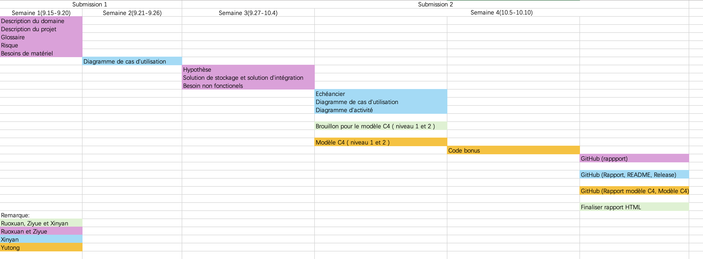
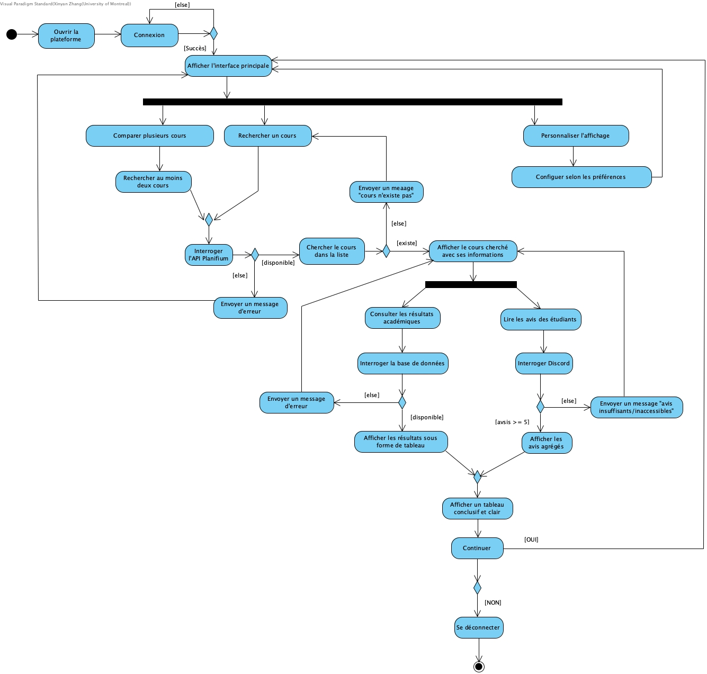
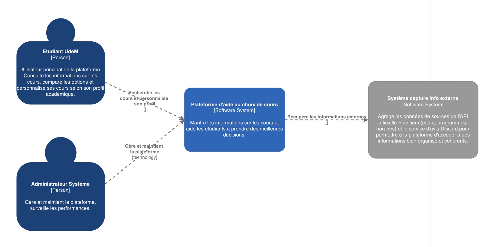
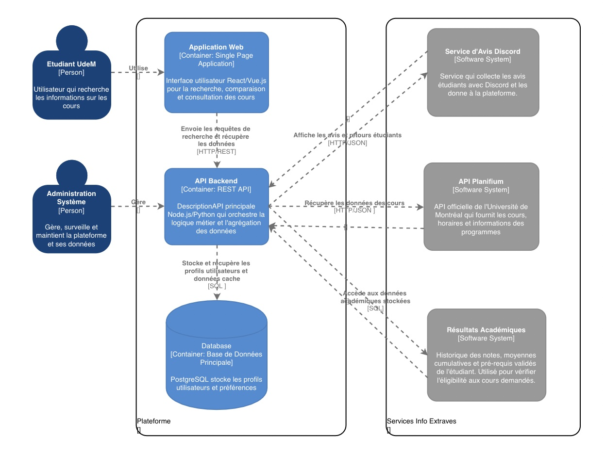

# Rapport du projet IFT2255

## 1. Cadre du projet

### Description du projet 
L’objectif principal est d’offrir un outil d’aide à la décision pour optimiser le choix de cours des étudiants du DIRO (Département d’informatique et de recherche opérationnelle). Le choix de cours constitue une étape cruciale dans le parcours académique des étudiants de l’Université de Montréal, particulièrement au Département d’informatique et de recherche opérationnelle (DIRO). 
La structure des programmes est parfois complexe et les sources d’information disponibles sont fragmentées : les données officielles partielles (Planifium, résultats globaux) et les avis étudiants éparpillés (forums, Discord).
Afin de faciliter la prise de décision et d’offrir une vue plus transparente et centralisée, le projet vise à concevoir une **plateforme web** basée sur une **API REST**, combinant les données officielles et les opinions des étudiants. 

Cette plateforme permettra aux étudiants de :
- rechercher et comparer des cours;
- consulter des résultats académiques agrégés;
- accéder à des avis étudiants représentatifs;
- personnaliser l’affichage selon leur profil et leurs contraintes.

La creation de cette platforme implique plusieurs acteurs dont:
- **les étudiants**, qui souhaitent choisir des cours adaptés à leur profil et à leurs objectif;
- **les professeurs** définissent le contenu, les objectifs et les prérequis des cours;
- **les TGDEs** valident les inscriptions et respectent les contraintes administratives;
- **les conseillers académiques** accompagnent les étudiants dans leur plan de cheminement;
- **l’administration et les services informatiques** de l’UDEM sont responsables de la mise à jour des données et de la conformité légale.

Ce document présente une première analyse des besoins, les cas d’utilisation principaux ainsi qu’une identification des risques, afin de préparer les prochaines étapes de conception et d’implémentation.

### Fonctionnement du système
Le système proposé vise à assister les étudiants de l’Université de Montréal dans la **prise de décision pour le choix de cours**.

Son fonctionnement suit un processus interactif et incrémental, conforme au modèle de développement enseigné (modèle en V / itératif-incrémental) :

1. **Authentification et profil utilisateur**
   - Connexion via **SSO UdeM** ; création automatique du profil étudiant.
   - Le profil contient les **préférences** (théorie/pratique, charge de travail souhaitée, plages d’horaires, contraintes personnelles).

2. **Recherche de cours**
   - L’étudiant saisit le mot-clé ou le code du cours.
   - Le système interroge **l’API Planifium** pour obtenir les informations officielles : code, titre, crédits, cycle, horaires, pré- et co-requis.
   - Les résultats sont présentés avec l’indicateur d’**éligibilité** calculé selon le cheminement de l’étudiant.

3. **Consultation des résultats académiques**
   - Le système charge les données agrégées depuis les fichiers **CSV** (moyenne, nombre d’inscrits, échecs).
   - L’information est stockée dans une base de données relationnelle et présentée sous forme de tableaux statistiques clairs.

4. **Lecture des avis étudiants**
   - Un **bot Discord** recueille les évaluations (difficulté, charge, commentaire).
   - Les avis sont agrégés automatiquement et ne sont affichés que lorsque **n ≥ 5**, conformément à la règle métier.
   - Le système calcule des indicateurs synthétiques (moyenne, dispersion, mots-clés dominants).

5. **Comparaison et personnalisation**
   - L’étudiant ajoute plusieurs cours à un **panier de comparaison**.
   - Le moteur de comparaison combine les données officielles (Planifium / CSV) et les avis étudiants.
   - Les résultats sont **filtrés** et **classés** selon les préférences du profil pour offrir une expérience personnalisée.

6. **Mise à jour et sauvegarde**
   - Des **tâches d’import (ETL)** périodiques assurent la synchronisation avec Planifium, l’actualisation des CSV et la modération des avis Discord.
   - Tous les échanges sont sécurisés via HTTPS ; les données sont sauvegardées automatiquement.

### Dépendances du système
1. **Dépendances externes**
   - **API Planifium** : source officielle pour les programmes et horaires ; dépendance critique pour la recherche et la validation des prérequis.
   - **Bot Discord / API Discord** : collecteur des avis étudiants en format JSON ; dépendance asynchrone et soumise à la disponibilité du service Discord.
   - **Fichiers CSV fournis par l’administration** : données de résultats agrégées mises à jour à chaque session.
   - **SSO UdeM** : service d’authentification institutionnel obligatoire pour accéder au profil.

2. **Dépendances internes (techniques)**
   - **Base SQL** : stockage des résultats académiques (moyennes, taux d’échec, nombre d’inscrits).
   - **Base NoSQL (JSON/Document Store)** : stockage des avis étudiants et métadonnées.
   - **Moteur de filtrage et de personnalisation** : applique les préférences utilisateurs aux recherches et comparaisons.
   - **Service API interne (REST)** : gère la communication entre l’interface web, la logique métier et les bases de données.
   - **Module de cache** : optimise les temps de réponse (objectif P95 < 2 s).
   - **Système de journalisation et surveillance** : collecte des métriques (latence, taux d’erreur) et déclenchement d’alertes.

3. **Dépendances organisationnelles et légales**
   - **Loi 25 (Québec)** : encadrement légal du traitement des données personnelles ; anonymisation et consentement obligatoires.
   - **Services informatiques de l’UdeM** : hébergement, certificats HTTPS, maintenance du SSO.
   - **Cycle académique** : contraintes temporelles (périodes d’inscription, début de session) influençant la charge du système.
   - **Ressources humaines** : auxiliaires responsables de l’import des fichiers CSV, de la modération des avis et de la vérification de conformité.

### Équipe : 

Ruoxuan Hu (20304027) , username Discord : rx_04

Ziyue Wang (20308297) , username Discord : ZY

Xinyan Zhang (20264873) , username Discord : Xinyan

Yu Tong Zhu (20310738) , username Discord : yutong

### Distribution des tâches : 

#### Première soumission (Septembre 26) :

Ziyue Wang (20308297) et Ruoxuan Hu (20304027): 

- Description du domaine : acteurs
- Description du projet
- Glossaire : liste des termes et expressions utilisés lors de la premier soumission
- Risque : au moins 5 risques
- Besoins de matériel (sans les solutions)

Xinyan Zhang (20264873): 
- Diagrammes des cas d'utilisation

#### Version final (October 10) :

Ziyue Wang (20308297) et Ruoxuan Hu (20304027):  
- Les coordonées des membres
- Hypothèse 
- Solution de stockage et solution d’intégration
- Besoin non fonctionels
- GitHub (rappport)
- Brouillon pour le modèle C4 (niveau 1 et 2)
- Finaliser rapport HTML
- Rapport modèle C4

Xinyan Zhang (20264873): 
- Échéancier
- Diagramme de cas d’utilisation
- Diagramme d’activité
- Brouillon pour le modèle C4 (niveau 1 et 2)
- GitHub (Rapport, README, Release) 
- Finaliser rapport HTML

Yutong Zhu (20310738): 
- Rapport modèle C4
- Modèle C4
- GitHub (Rapport modèle C4, Modèle C4)
- Code bonus

### Échéancier : 

## 2. Analyse des exigences 

### Description du domaine 
**Utilisateurs visés**
   - Nouveaux étudiants (manque de repères académiques)

   - Étudiants en fin de parcours (diplomation, optimisation de la moyenne)

   - Étudiants internationaux (adaptation au système académique québécois)

   - Étudiants travailleurs (charge de travail limitée)

   - Étudiants parents (équilibre vie familiale et études)

   - Étudiants à temps plein / temps partiel

### Facteurs académiques
   - Moyenne de la classe

   - Taux de réussite / échec / abandon 

   - Nombre d’inscription 

   - Préalables et co-requis

   - Nombre de crédits attribués

   - Dates des examens 

   - Description officielle du cours

### Facteurs personnels
   - Charge de travail (devoirs, projets, lectures)

   - Rythme du cours

   - Intérêts académiques et orientation professionnelle

   - Préférence théorie / pratique

### Facteurs logistiques
   - Mode d’enseignement (présentiel, hybride, en ligne)

   - Compatibilité horaire

   - Contraintes de transport

### Facteurs sociaux
   - Avis étudiants (forums, Discord, bouche-à-oreille)

   - Réputation des enseignants

   - Niveau de stress perçu

### Sources de données
   - **Planifium API** : Catalogue officiel (codes, titres, crédits, horaires, préalables).

   - **Résultats académiques agrégés** : CSV (moyenne, inscrits, échecs).

   - **Avis étudiants (Discord)** : JSON via bot (difficulté perçue, charge de travail, commentaires).

## 3. Hypothèses
Ces hypothèses permettent de clarifier le cadre du projet et d’éviter les ambiguïtés lors de la conception.

Dans l’élaboration du projet, certaines hypothèses de travail ont été émises afin de délimiter le périmètre du système :
   - Tous les étudiants disposent d’un accès Internet stable et d’un navigateur moderne compatible (Chrome, Firefox, Edge, Safari).

   - Les données fournies par l’API Planifium sont fiables et mises à jour régulièrement par l’Université.

   - Les étudiants savent utiliser une interface web basique et sont capables de naviguer sur une plateforme en ligne.

   - L’authentification institutionnelle (SSO UdeM) est disponible et fonctionnelle pour identifier les utilisateurs.

   - Les avis étudiants collectés via Discord sont anonymisés et représentatifs d’un nombre suffisant de participants. (les étudiants sont avisés de la collecte des données et sont d’accord).

   - Le volume d’utilisateurs simultanés reste raisonnable (quelques milliers) et ne dépasse pas la capacité initiale prévue.

   - Les fichiers CSV des résultats académiques sont complets et mis à jour à la fin de chaque session.

   - La plateforme est utilisée sur des appareils compatibles et le design responsive fonctionne correctement.

   - Les échanges avec l’API Planifium et les services internes sont sécurisés (HTTPS) et certains, sans pertes de données pendant les transferts.

## 4. Glossaire
   - **Planifium API** : Service fournissant les données officielles des cours/programmes de l’UdeM.
  
   - **Format CSV** : Format de fichier tabulaire utilisé pour stocker les résultats académiques agrégés.
  
   - **Résultats académiques agrégés (CSV)** : Données statistiques globales d’un cours (moyenne, inscrits, échecs).
  
   - **JSON** : Format d’échange de données structurées, utilisé pour stocker et transmettre les avis des étudiants.
  
   - **Avis étudiants**: Retours qualitatifs/quantitatifs collectés via Discord (JSON).

   - **Loi 25** : Loi québécoise sur la protection des renseignements personnels (préserver la confidentialité).

   - **Mot-clé (Recherche)** : Code, titre ou fragment de texte utilisé par l’étudiant pour retrouver un cours.
  
   - **Bloc d’horaire** : Bloc du cours - matin (8:30-13:30), après-midi (13:30-18:30) et soir (18:30-22:30)
  
   - **Type d’utilisateur** : Les étudiants internationaux (12 crédits), les étudiants à temps plein (12-18 crédits), les étudiants à temps partiels (>6 crédits), les étudiants parents et les étudiants qui travaillent (option de bloc d’horaire).
  
   - **Utilisateur** :Les étudiants qui veulent obtenir des informations académiques qui les aident dans leur cheminement académique.
  
   - **Numéro d’utilisateur** : La matricule attribuée à chacun des étudiants de la part de l’institution (UDEM).
  
   - **Service** : Fournir les informations à propos d’un cours et de ses informations complémentaires (ex : notes, avis sur les profs, taux d’échec, moyenne, etc.).
  
   - **Administrateur système** : Maintenance et mise à jour des nouveaux cours.
  
   - **Information personnelle** : Les préférences fournies (ex : jour de la semaine des cours, tri des semestres fourni par l’école, bloc de la journée, etc) par les utilisateurs (les étudiants).

   - **Tableau comparatif** : Vue synthétique qui regroupe les données de plusieurs cours afin de faciliter leur comparaison.

   - **Panier de cours** : Liste temporaire de cours sélectionnés par l’étudiant en vue d’une comparaison.

   - **Préférences (Profil)** : Paramètres définis par l’étudiant (théorie/pratique, contraintes personnelles) afin de personnaliser l’affichage des résultats.

   - **Moteur de filtrage** : Composant logiciel qui applique les préférences de l’étudiant pour trier et adapter la liste de cours affichée.

## 5. Risques du projet
 ### 1. Données incomplètes ou biaisées

- Problème: Les avis des étudiants sont souvent subjectifs (influence des préférences personnelles, style d’enseignement, difficultés perçues) ou insuffisants. De plus, s’il y a trop peu d’avis, les résultats sont faussés et peu représentatifs.
  
- Conséquences : Les étudiants risquent de prendre de mauvaises décisions basées sur un échantillon non fiable.

- Atténuation :

   i. Seuil minimal (≥ 5 avis) avant d’afficher une évaluation globale
  
   ii. Utiliser les méthodes d’agrégation statistique (moyenne, médiane) pour réduire l’effet des avis extrêmes
  
   iii. Ajouter un avertissement visuel et voyant quand les données sont jugées insuffisantes.

 ### 2. Confidentialité et Loi 25

- Problème : Le projet manipule des données sensibles des étudiants (profils, préférences, historiques). Une mauvaise gestion des données peut mener à une violation de la Loi 25.
- Conséquence : Cela peut causer la perte de confiance des utilisateurs, à des sanctions légales et financières.

- Atténuation :

   i. Mise à jour d’une anonymisation stricte des données
  
   ii. Respect des principes de minimisation des données (on collecte seulement ce qui est nécessaire)
  
   iii. Vérification régulière de conformité légale.

### 3. Données obsolètes ou incohérentes

- Problème : Les informations affichées peuvent différer des données officielles (ex : décalage entre Planifium et résultats réels).
  
- Conséquences : L’étudiant peut prendre de mauvaises décisions

- Atténuation :

   i. Synchronisation régulière
  
   ii. Affichage des dates de mise à jour pour chaque donnée

### 4. Accessibilité limitée

- Problème : Difficulté d’accès pour certains profils (connexion lente, mobile).
- Conséquence : Temps de chargement long, interface illisible ou non responsive

- Atténuation :

   i. Conception mobile-first
  
   ii. Respect des normes WCAG.

### 5. Performance et surcharge technique

- Problème : Trop de requêtes simultanées peuvent ralentir le plateforme ou causer des interruptions.
- Conséquence : Expérience des utilisateurs dégradée, risque d’abandon de la plateforme.

- Atténuation :

   i. Mise en place d’un système de cache pour éviter les recalculs inutiles.
  
   ii. Architecture scalable
  
   iii. Surveillance en temps réel des performances avec alertes proactives.

### 6. Accessibilité limitée pour les étudiants handicapé
- Problème : Difficulté d’accès pour des étudiants en handicap qui sont des personnes aveugles, sourdes ou ayant des troubles cognitifs.
  
- Conséquence : Exclusion d’une partie de la communauté étudiante.

- Atténuation :
 
   i. Intègre les lecteurs d'écran
  
   ii. Option de personnalisation de l’affichage (agrandir la taille du texte, simplifier la mise en page)

## 6. Besoins non fonctionnels
Au-delà des fonctionnalités principales, la plateforme doit répondre aux exigences de qualité suivantes :

   - **Performance** : Chaque requête (recherche, comparaison, consultation) doit être traitée en moins de 2 secondes afin de garantir une navigation fluide.

   - **Sécurité** : Les données personnelles doivent être protégées conformément à la Loi 25, avec chiffrement des échanges et anonymisation stricte.

   - **Fiabilité** : La plateforme doit assurer une disponibilité de 99 % pendant les périodes critiques (inscriptions, début de session).
  
   - **Évolutivité** : L’architecture doit permettre l’intégration future d’autres sources de données (ex. évaluations professorales, API supplémentaires).
  
   - **Utilisabilité** : Accessibilité aux personnes à handicap, bon affichage sur mobile, tablette et PC.
  
   - **Mémoire** : N’utilise pas trop d’espace sur l'ordinateur.
  
   - **Maintenabilité** : Le code et l’architecture doivent être bien documentés pour faciliter les mises à jour, la correction de bugs et l’ajout de nouvelles fonctionnalités. Système capable de recevoir des mise à jour logicielles à distance.
  
- **Multilinguisme** : La plateforme peut être utilisée en français et en anglais pour soutenir les étudiants internationaux.

## 7. Besoins matériels, solution de stockage et solution d’intégration (Conformité et sécurité)
Les besoins matériels définissent les ressources physiques et logicielles nécessaires au bon fonctionnement de la plateforme.

Le système repose sur une architecture client-serveur hébergée sur une infrastructure virtuelle. 

Cette configuration vise à garantir la performance, la sécurité et la capacité d’évolution du système, conformément aux exigences physiques vues en cours.

#### Besoins matériels et solutions proposées
   - **Serveur d’application (Backend)** :
     Hébergé sur un serveur virtuel (cloud UdeM ou infonuagique public) doté de processeurs virtuels (vCPU), suffisamment de mémoire vive et de stockage SSD. 
     Le système d’exploitation recommandé est Linux, configuré pour le déploiement.

   - **Serveur de base de données** :
      Hébergé séparément pour assurer la sécurité et l’intégrité des données.
      Une base de données relationnelle est utilisée pour enregistrer les résultats académiques. Elle permet de stocker les moyennes, les taux d’échec et le nombre d’inscriptions pour chaque cours.
      Des sauvegardes automatiques sont faites régulièrement pour éviter toute perte d’information.

   - **Postes clients** :
      Utilisation possible à partir de navigateurs récents tels que Chrome, Firefox, Edge ou Safari.
      Le design est responsive, permettant un accès fluide sur ordinateur, tablette ou mobile, y compris hors campus.

   - **Réseau et bande passante** :
     Une connexion minimale de 10 Mo/s est requise pour interroger l’API Planifium et Discord.
     Un cache local est mis en place afin de réduire les appels redondants et d’optimiser les performances.

   - **Accessibilité et hébergement** :
     L’interface est accessible et adaptée à différents types d’appareils et d’utilisateurs.

### Solution de stockage et sécurité
La solution de stockage combine des technologies relationnelles et non relationnelles pour gérer différents types de données et assurer leur intégrité, leur sécurité et leur évolutivité.

   - **Résultats académiques** :
     Les fichiers CSV fournis par l’administration sont importés dans une base de données relationnelle.
     Cette base permet d’effectuer des requêtes structurées, d’assurer la cohérence des statistiques et de gérer les agrégations par session ou trimestre.

   - **Avis étudiants** :
     Collectés via un bot Discord et enregistrés dans une base de données qui peut gérer des avis et des commentaires d’étudiants. Ce modèle permet de traiter des données semi-structurées et évolutives (commentaires, évaluations, métadonnées).

   - **Profils étudiants et préférences** :
     Les données des utilisateurs (cheminement, préférences de cours, contraintes personnelles) sont enregistrées dans une section sécurisée, liée à leur identifiant institutionnel via le SSO (authentification unique) UdeM.

   - **Fichiers journaux et statistiques** :
     Les journaux d’activité et les mesures de performance sont sauvegardés dans des fichiers JSON structurés pour assurer la traçabilité, la supervision et la maintenance proactive du système.

   - **Sécurité et confidentialité** :
     Toutes les données sensibles sont protégées lorsqu’elles sont enregistrées et lorsqu’elles sont transmises sur le réseau.
     Les accès sont contrôlés par rôles (étudiant, auxiliaire, administrateur).
     Les avis étudiants sont anonymisés avant publication, en conformité avec la Loi 25.
     Des sauvegardes quotidiennes avec rétention de 30 jours sont réalisées, et l’architecture est scalable horizontalement (via CDN et cache Redis) pour absorber la charge.

### Solution d’intégration
La solution d’intégration garantit la cohérence des échanges entre les différents services internes et externes de la plateforme.

   - **API Planifium (Université de Montréal)** :
     L’API REST de Planifium est utilisée pour obtenir les informations officielles sur les programmes, cours, horaires, crédits et prérequis.
     Les données sont synchronisées quotidiennement via un processus automatisé et mises en cache localement pour réduire le délai d’attente.

   - **Bot Discord (Avis étudiants)** :
     Le bot recueille automatiquement les avis et notes des étudiants.
     Les messages sont filtrés pour que toute information personnelle (PII) soient supprimés avant leur transformation en JSON et leur insertion dans la base NoSQL.

   - **Authentification SSO UdeM** :
     L’accès au système est protégé par une authentification institutionnelle, garantissant un lien unique entre les préférences et l’identité de l’étudiant.

   - **API interne REST (backend)** :
     Le système expose plusieurs points d’accès (/courses, /results, /compare, /reviews, /profile) permettant à l’interface utilisateur et aux services internes de communiquer en format JSON sur protocole HTTPS.

   - **CI/CD et supervision technique** :
     Le déploiement est automatisé via GitHub Actions.
     La performance et la stabilité sont surveillées en continu, et des alertes sont envoyées en cas d’erreur ou de lenteur du système.

### Solutions techniques globales
L’architecture générale de la plateforme suit le modèle itératif et incrémental (I&I) enseigné en cours.

Chaque incrément (ex. recherche, avis, comparaison) est développé, testé et intégré progressivement, ce qui permet des retours fréquents et une amélioration continue.

L’approche repose sur une architecture composée de plusieurs parties qui communiquent entre elles.

Chaque partie du système a un rôle précis (recherche, affichage, gestion des données) et elles échangent des informations de manière organisée et sécurisée.
 Cette solution assure :
 
   - la **modularité** et la **faible dépendance** entre les composants,

   - la **sécurité** et la conformité légale (Loi 25, chiffrement complet),

   - la **scalabilité** et la **résilience** du système,

   - et la **maintenabilité** à long terme grâce à une documentation claire et un déploiement automatisé.

Dans son ensemble, cette configuration matérielle et logicielle soutient les objectifs pédagogiques du projet : offrir une plateforme performante, transparente et évolutive, conforme aux standards de génie logiciel enseignés à l’Université de Montréal.

## 8. Cas d’utilisation principaux

### CU1 – Rechercher un cours

- **But** : Un étudiant qui désire s’informer sur un cours spécifique (prérequis, nombre de crédits, description officielle du cours,etc.)
- **Précondition** : L’étudiant est connecté et a accès à la plateforme.
- **Acteurs** : Étudiants (principal), professeur API (secondaire)
- **Déclencheur** : L’étudiant saisit un mot-clé (ex. “IFT2255”) dans la barre de recherche.
     - L’étudiant clique sur la barre de recherche.
     - L’étudiant sélectionne un filtre ou une catégorie avant le mot-clé.
 

- **Dépendances** :
  
1. Dépendances techniques :
  
   - Dépend de l’API Planifium pour la disponibilité et l’exactitude des informations.
  
   - Dépend de la connexion Internet stable de l’étudiant.
  
2. Dépendances logiques (UML):
  
   - Le CU “Rechercher un cours” peut être utilisé comme prérequis pour d'autres CU.

     - Ex : Pour CU2 : “Consulter les résultats académiques d’un cours”
  
     - Ex : Pour CU3 : “Lire les avis des étudiants”
  
- **Scénario principal** :

1. L’étudiant entre un mot-clé, un titre (ex : “IFT2255” ou “IFT”).
2. Le système interroge l’API Planifium avec la requête.
3. Le système récupère la liste des cours correspondants.
4. Le système comme les prérequis, le nombre de crédits, la description officielle du cours, etc.
5. Le système indique si l’étudiant est éligible (ou non) à suivre chaque cours en fonction de son cheminement actuel.

- **Scénario alternatif** :

4.a : Aucun cours trouvé : Le système affiche un message indiquant qu’aucun cours ne correspond à la recherche.

4.a.1 Le système reprend à l’étape 1.

4.b : L’API Planifium est indisponible : Le système affiche un message d’erreur et propose à l’étudiant de réessayer plus tard (peut-être dû à un problème de connexion d’internet ou problème du site web).

4.b.1 : Le scénario se termine.

4.c : Requête invalide : Si la recherche contient des caractères invalides ou des saisies trop courtes, le système va demander à l’étudiant de reformuler sa recherche.

4.c.1 : Le système n’a pas trouvé de cours.

4.c.2 : Le système affiche Numéro non valide à l’écran.

4.c.3 : Le scénario reprend à l’étape 1.

- **Postcondition** : La liste des cours est affichée avec toutes les informations pertinentes et l’indication d’éligibilité.

### CU2 – Consulter les résultats académiques d’un cours
- **But** : Permettre à l’étudiant de consulter des statistiques d’un cours (moyenne, nombre d’inscrits, taux d’échec, etc.) afin d’évaluer sa difficulté.
- **Précondition** : Des résultats agrégés (format CSV) sont disponibles pour le cours sélectionné.
- **Acteurs** : Étudiant (principal), Système (plateforme qui récupère et affiche les résultats) (secondaire)
- **Déclencheur** : L’étudiant clique sur l’option « Consulter les résultats » pour un cours donné.
   - L’étudiant recherche un cours (CU1) puis clique sur “Consulter les résultats”.
   - L’étudiant accède à un cours via une autre fonctionnalité (ex : CU3 “Lire les avis des étudiants”) et choisit ensuite de voir les résultats.
 
- **Dépendances** :

1. Dépendances techniques : 
   - Dépend de la disponibilité des fichiers CSV de résultats académiques. 
   - Dépend de la base de données interne pour charger les statistiques.
   - Dépend d’une connexion internet stable.
  
2. Dépendances logiques (UML) : 
   - CU1 est “include”, car pour consulter les résultats d’un cours, l’étudiant doit d’abord rechercher le cours.
   - CU3, CU4 et CU5 sont “exclude”. 
      - CU3 : cela est optionnel parce que l’étudiant peut décider de lire les avis ou non après avoir consulté les résultats académiques.
      - CU4 : cela est optionnel, car l’étudiant peut choisir de prolonger l’action en comparant les résultats de plusieurs cours.
      - CU5 : cela est optionnel, car l'étudiant peut choisir la forme d’affichage des résultats (ex : sous forme de tableau, avec certains filtres (par session, par année, etc). selon ses préférences.
    

- **Scénario principal** :

1. L’étudiant accède à la fonctionnalité “Consulter les résultats”.
2. L’étudiant sélectionne un cours dans la liste proposée.
3. Le système interroge la base de données (CSV).
4. Le système charge les données pertinentes (moyenne, nombre d’inscrits, taux d’échec, etc).
5. Le système affiche les résultats sous forme de tableau.
6. L’étudiant consulte les résultats.

- **Scénario alternatif** : 
4.a Les résultats ne sont pas disponibles pour le cours sélectionné (cours trop récent ou données manquantes).
  
4.a.1 Le système affiche Aucun résultat disponible pour ce cours.

4.a.2 Le scénario reprend à l’étape 2.

4.b Le fichier CSV ou la connexion à la base de données est inaccessible.

4.b.1 Le système affiche Erreur de chargement des résultats, veuillez réessayer plus tard.

4.b.2 Le scénario se termine.

- **Postcondition** : L’étudiant visualise les statistiques du cours et peut estimer la difficulté du cours à partir de données objectives.

### CU3 – Lire les avis des étudiants
- **But** : Un étudiant souhaite consulter les avis de ses pairs sur un cours afin de mieux évaluer sa charge de travail et sa difficulté.
- **Acteurs** : Étudiant (principal), Système, service d’avis (secondaire)
- **Déclencheur** : L’étudiant ouvre la fiche d’un cours et sélectionne l’onglet « Avis étudiants ».
    - L'étudiant sélectionne un bouton “Voir les avis” associé à un cours dans la liste des résultats.

- **Dépendances** : 
1. Dépendances techniques : 
   - Dépend de la base de données des avis (JSON) mise à jour via le bot Discord. 
   - Dépend de la disponibilité du service d’agrégation des avis.
  
2. Dépendances logiques (UML) : 
   - CU1 est “include” parce que l’étudiant doit d’abord trouver le cours avant de pouvoir lire les avis des autres.
   - CU2, CU4, CU5 sont “exclude”
       - CU2 : après avoir consulté les avis, l’étudiant peut choisir de prendre sa décision avec des données quantitatives (moyenne, taux d’échec, etc).
       - CU4 : les avis lus peuvent être intégrés dans une comparaison entre plusieurs cours.
       - CU5 : l’étudiant peut décider de trier par pertinence, par date ou de filtrer par des critères (ex : années, type d'étudiant, etc.)
    
         
- **Précondition** : Au moins 5 avis sont disponibles pour le cours.

- **Scénario principal** :

1. L’étudiant ouvre la fiche d’un cours.
2. Le système interroge la base des avis (JSON).
3. Le système affiche les avis agrégés (charge de travail, difficulté, commentaires).
4. l’étudiant consulte les avis affichés.

- **Scénarios alternatifs** :
 
4.a : Moins de 5 avis disponibles pour le cours.

4.a.1 : Le système affiche Avis insuffisant pour ce cours.

4.a.2 : Le scénario se termine.

4.b : La base des avis est inaccessible (erreur technique).

4.b.1 : Le système affiche Erreur de chargement des avis, veuillez réessayer plus tard.

4.b.2 : Le scénario se termine.

4.c : Aucun avis trouvé (cours très récent).

4.c.1 : Le système affiche Aucun avis n’a encore été publié pour ce cours.

4.c.2 : Le scénario reprend à l’étape 1 si l’étudiant veut consulter un autre cours.

- **Postcondition** : L’étudiant visualise un retour qualitatif (commentaires) et quantitatif (charge de travail, difficulté) sur ce cours. 

### CU4 – Comparer plusieurs cours
- **But** : Un étudiant souhaite comparer plusieurs cours afin d’évaluer leur comptabilité et la charge globale.
- **Acteurs** : Étudiant (principal), Système (secondaire)
- **Déclencheur** : L’étudiant sélectionne plusieurs cours dans son panier et clique sur « Comparer ».
    - L’étudiant clique sur l’option “Ajouter à la comparaison”, puis répète l’action pour un ou plusieurs cours avant de lancer la comparaison.
    - L’étudiant a ajouté plusieurs cours dans son panier de sélection et clique sur le bouton “Comparer”. 

- **Dépendances** : 
1. Dépendances techniques : 
   - Dépend des données académiques (crédits, résultats) et des avis étudiants pour chaque cours sélectionné. 
   - Dépend du module de compilation des comparaisons.
2. Dépendances logiques : 
   - CU1 et CU2 sont “include”
     - CU1 : cela est indispensable, car l’étudiant doit avoir trouvé les cours avant de pouvoir les comparer.
     - CU2 : cela est inclus, car la comparaison nécessite toujours des statistiques académiques.
   - CU3 et CU5 sont “exclude”
     - CU3 : ce n’est pas obligatoire, mais cela peut enrichir la comparaison si l’étudiant souhaite consulter les avis des étudiants.
     - CU5 : ce n’est pas obligatoire, mais cela permet à l’étudiant d'adapter la forme de la comparaison des cours (ex : sous forme de tableau, filtrer certains éléments, etc)
    
- **Précondition** : L’étudiant a ajouté au moins deux cours à sa sélection.

- **Scénario principal** :

1. L’étudiant sélectionne plusieurs cours (deux cours ou plus).
2. Le système récupère les données académiques (crédits, taux d’échec, moyenne) et les avis pour chaque cours.
3. Le système compile et organise les données.
4. Le système présente un tableau comparatif clair.
5. L’étudiant consulte le tableau pour évaluer ses choix.

- **Scénario alternatif** :
  
4.a : Moins de deux cours sélectionnés.
  
4.a.1 Le système affiche Veuillez sélectionner au moins deux cours pour comparer.

4.a.2 : Le scénario reprend à l’étape 1.

4.b : Les données d’un des cours sont manquantes (avis ou résultats).

4.b.1 : Le système affiche Certaines informations sont indisponibles pour un ou plusieurs cours.

4.b.2 : Le système affiche tout de même le tableau avec les données disponibles.

4.b.3 : Le scénario reprend à l’étape 6.

- **Postcondition** : L’étudiant peut visualiser la compatibilité et la charge globale de ses choix.

### CU5 – Personnaliser l’affichage
- **But** : Un étudiant souhaite obtenir des résultats adaptés à ses préférences personnelles.
- **Acteurs** : Étudiant (principal), Système (secondaire)
- **Déclencheur** : L’étudiant accède à la section « Préférences » et active la personnalisation.
    - L’étudiant modifie ou active les options de personnalisation (ex : filtrer par type de cours, charge de travail, etc)

- **Dépendances** : 
1. Dépendances techniques :
   - Dépend de la base de données utilisateur pour stocker les préférences. 
   - Dépend du moteur de filtrage et de tri pour appliquer ces préférences aux recherches.
2. Dépendances logiques : 
   - CU1 et CU4 sont “include”
     - CU1 : à chaque fois que l’étudiant effectue une recherche, les préférences définies (ex : éviter les cours du soir, privilégier les cours pratiques, etc) sont automatiquement appliquées. 
     - CU4 : la personnalisation est aussi appliquée dans le tableau comparatif (ex : trier par charge de travail, n’affiche que certains critères, etc). 
   - CU2 et CU3 sont “extend”
     - CU2 : un étudiant peut demander à ce que ses préférences influencent la manière dont les statistiques sont présentées (ex : n’affiche que la moyenne, masquer le taux d’échec si jugé non pertinent, etc)
     - CU3 : l’étudiant peut personnaliser les avis qu’il souhaite voir (ex : avis de cours pratique, avis récents uniquement, etc).
    
- **Précondition** : L’étudiant a renseigné ses préférences dans son profil.

- **Scénario principal** :

1. L’étudiant accède à la section Préférences.
2. L’étudiant configure ses préférences (pratique/théorie, intérêts, contraintes).
3. Le système enregistre ces préférences dans le profil de l’étudiant.
4. Lors de la recherche, le système trie et filtre les résultats en fonction du profil.
5. Le système affiche la liste personnalisée des cours. 
6. L’étudiant consulte les résultats adaptés.

- **Scénario alternatif** :
  
4.a : L'étudiant n'a défini aucune préférence.

4.a.1 : Le système affiche Aucune préférence trouvée. Veuillez configurer votre profil pour activer la personnalisation.

4.a.2 : Le scénario reprend à l’étape 1.

4.b : Les préférences de l’étudiant sont incohérentes ou trop restrictives (aucun cours compatibles)

4.b.1: Le système affiche Aucun cours ne correspond à vos critères.

4.b.2 : Le système propose d’élargir les préférences.

4.b.3 : Le scénario reprend à l’étape 2.

- **Postcondition** : L’étudiant obtient une expérience personnalisée et adaptée à son profil.

### Diagramme de cas d'utilisation

## 9. Diagramme d'activités

## 10. Modèle C4
### Niveau 1 : Diagramme de contexte
Objectif: Décrire les limites externes du système et ses principales interactions avec les utilisateurs et systèmes externes.

Système principal:
   - Plateforme d’aide aux choix de cours
     - Centralise les informations sur les cours et aide les étudiants dans leur processus de sélection.
     
Acteurs principaux:

   - Étudiants [Personne]
     
     - Utilisateur principal de la plateforme
       
     - Consulte les informations sur les cours
       
   - Administrateurs système [Personne]
     
     - Gère la plateforme et la maintenance

Système externes:

   - API Planifium [API]
     
     - Donne les données officielles des cours, programmes et horaires
       
   - Service d’avis Discord [Système]
     
     - Collecte les avis étudiants avec un bot Discord
       
   - Résultats académiques [Base de données CSV]
     
     - Données agrégées des résultats

### Niveau 2 : Diagramme des conteneurs
Objectif: Détailler l’architecture interne principale du système et les interactions entre les conteneurs

1. Application Web [Application Client-Side]
   
   - Communication: API REST avec le backend
   - Responsabilités:
     
      - Interface utilisateur responsive
	  
      - Recherche et comparaison de cours
	  
      - Visualisation des données
	  
2. API Backend [Application Server-Side]

   - Responsabilités: 
	
     - Gestions des profils utilisateurs
	  
     - Sécurité et authentification
	  
   - Communication:
	
      - Application Web (REST)
	  
      - Services externes
	  
3. Base de données principale [Base de données]

   - Responsabilités:
	
     - Stockage des profils utilisateurs
	  
4. Service d'agrégations des avis [Software System]

   - Responsabilités:
	
     - Collecte des avis avec Discord
	  
     - Application des seuils statistiques (n>=5)
	  
     - Agrégation et traitement des données
	  
5. Résultats académiques [Software System]

   - Responsabilités: 
   
     - Stocker l’historique des notes et moyennes
	  
     - Assurer que chaque étudiant possède les prérequis nécéssaire

### Niveau 3 : Diagramme des composants (API Backend)
Objectif: Développer le conteneur API Backend pour montrer ses composants internes.

1. Contrôleur d’authentification
   - Gestion des sessions utilisateur
2. Contrôleur de recherche
   - Gestion des paramètres de recherche
3. Service Planifium
   - Client API pour Planifium
   - Gestion des erreurs et retry
4. Moteur de recommandations
   - Algorithmes de suggestion basés sur le profil
   - Analyse des similarités entre cours

## Modèle C4 niveau 1

## Modèle C4 niveau 2

