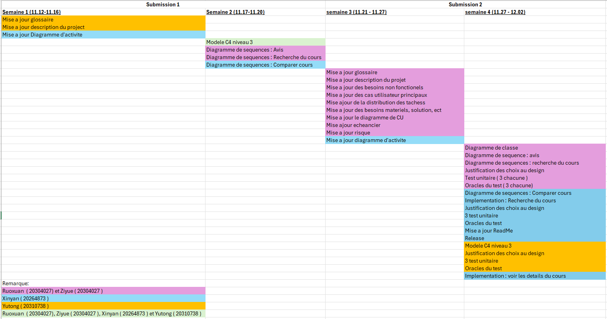
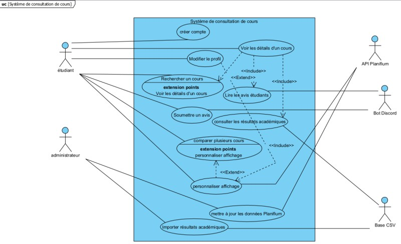
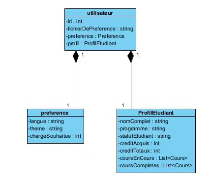
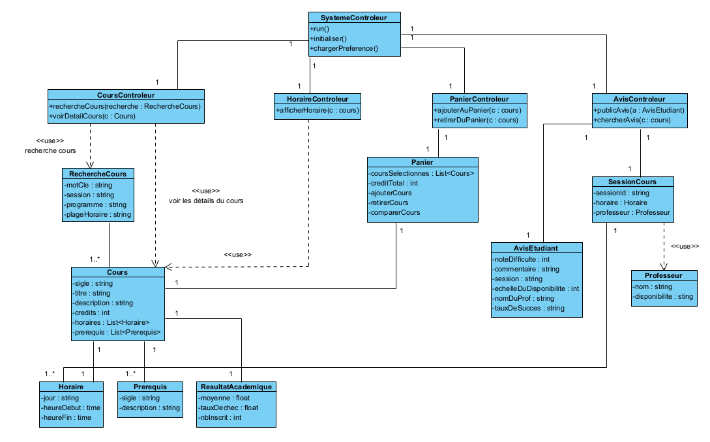
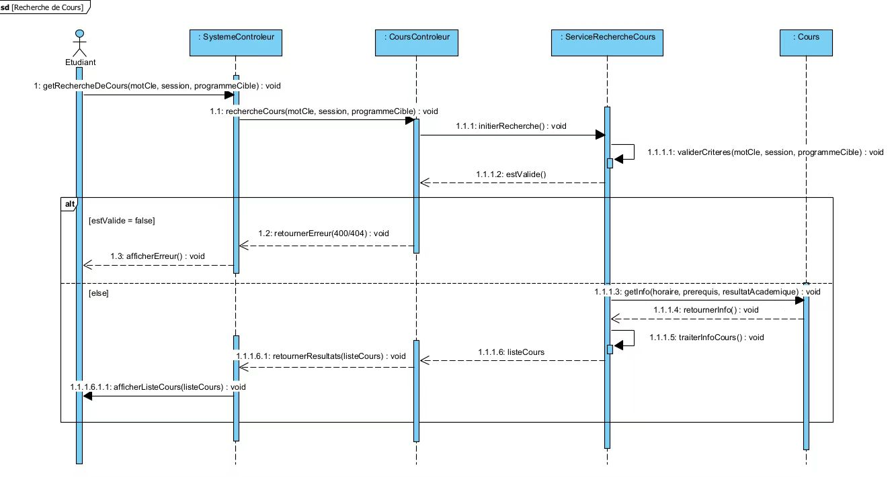
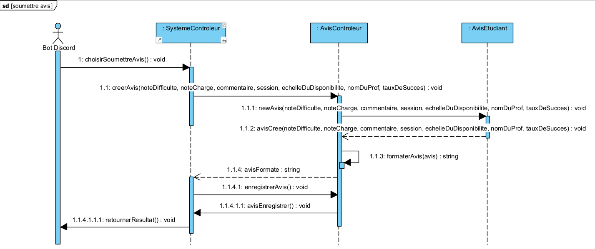

# Rapport du projet IFT2255

## 1. Cadre du projet

### Description du projet 
L’objectif principal est d’offrir un outil d’aide à la décision pour optimiser le choix de cours des étudiants du Département d’informatique et de recherche opérationnelle (DIRO). Le choix de cours constitue une étape cruciale dans le parcours académique des étudiants de l’Université de Montréal, particulièrement au DIRO. 
La structure des programmes est parfois complexe et les sources d’information disponibles sont fragmentées : les données officielles partielles (Planifium, résultats globaux) et les avis étudiants éparpillés (forums, Discord).
Afin de faciliter la prise de décision et d’offrir une vue plus transparente et centralisée, le projet vise à concevoir une **plateforme web** basée sur une **API REST**, combinant les données officielles et les opinions des étudiants. 

Cette plateforme permettra aux étudiants de :
- rechercher et comparer des cours;
- consulter des résultats académiques agrégés;
- accéder à des avis étudiants représentatifs;
- personnaliser l’affichage selon leur profil et leurs contraintes.

La création de cette plateforme implique plusieurs acteurs dont:
- **les étudiants**, qui souhaitent trouver des cours adaptés à leur cheminement et qui correspond à leurs besoins;
- **les professeurs** définissent le contenu, les objectifs, les horaires du cours, les prérequis des cours et leur disponibilités;
- **les TGDEs** valident les demandes d'inscriptions au cours et respectent les contraintes administratives;
- **les conseillers académiques** accompagnent les étudiants dans leur parcour universitaire et leur fournir des conseils académiques;
- **l’administration et les services informatiques** de l'université de Montréal (UDeM) sont responsables de la mise à jour des données et de la conformité légale.

### Fonctionnement du système
Le système proposé vise à assister les étudiants de l’Université de Montréal dans la **prise de décision pour le choix de cours** ：

1. **Authentification et profil utilisateur**
   - Connexion via **SSO UdeM** ; création automatique du profil étudiant.
   - Le profil contient les **préférences** (théorie/pratique, charge de travail souhaitée, plages d’horaires, contraintes personnelles).

2. **Recherche de cours**
   - L’étudiant saisit le mot-clé ou le code du cours.
   - Le système interroge **l’API Planifium** pour obtenir les informations officielles : code, titre, crédits, cycle, horaires, pré-rquis et co-requis.
   - Les résultats sont présentés avec l’indicateur d’**éligibilité** calculé selon le cheminement de l’étudiant.
   - Les professeurs et TGDEs valident la cohérence des informations affichées.

3. **Consultation des résultats académiques**
   - Le système charge les données agrégées (moyenne, nombre d’inscrits, taux d'échecs) depuis les fichiers **CSV** ou fournies par l'administration.
   - L’information est stockée dans une base de données relationnelle et présentée sous forme de tableaux statistiques clairs et à jour.

4. **Lecture des avis étudiants**
   - Un **bot Discord** recueille les évaluations (difficulté, charge de travail, commentaires).
   - Les avis sont agrégés automatiquement et ne sont affichés que si le nombre minimal d'avis **n ≥ 5** est atteint, conformément à la règle métier.
   - Le système calcule des indicateurs synthétiques (moyenne, dispersion, mots-clés dominants).

5. **Comparaison et personnalisation**
   - L’étudiant ajoute plusieurs cours à un **panier de comparaison**.
   - Le moteur de comparaison combine les données officielles (Planifium / CSV) et les avis étudiants.
   - Les résultats sont **filtrés** et **classés** selon les préférences du profil pour offrir une expérience personnalisée.

6. **Mise à jour et sauvegarde**
   - Des **tâches d’import (ETL)** périodiques assurent la synchronisation avec Planifium, la mise à jour des données académiques et la modération des avis Discord.
   - Tous les échanges sont sécurisés via HTTPS ; les données sont anonymisées selon la loi 25 et sont sauvegardées automatiquement.

### Dépendances du système
1. **Dépendances externes**
   - **API Planifium** : source officielle pour les programmes, les horaires et les prérequis ; dépendance critique pour la recherche de cours et la validation des prérequis.
   - **Bot Discord / API Discord** : collecteur des avis étudiants en format JSON ; dépendance asynchrone et soumise à la disponibilité du service Discord.
   - **Fichiers CSV fournis par l’administration** : données de résultats académiques agrégées ; mises à jour à chaque session.
   - **SSO UdeM** : service d’authentification institutionnel obligatoire pour accéder au profil étudiant.

2. **Dépendances internes (techniques)**
   - **Base SQL** : stockage des résultats académiques (moyennes, taux d’échec, nombre d’inscrits).
   - **Base NoSQL (JSON/Document Store)** : stockage des avis étudiants et métadonnées.
   - **Moteur de filtrage et de personnalisation** : applique les préférences utilisateurs aux recherches et comparaisons.
   - **Service API interne (REST)** : gère la communication entre l’interface web, la logique métier et les bases de données.
   - **Module de cache** : optimise les temps de réponse (objectif P95 < 2 s).
   - **Système de journalisation et surveillance** : collecte des métriques (latence, taux d’erreur) et déclenchement d’alertes.

3. **Dépendances organisationnelles et légales**
   - **Loi 25 (Québec)** : encadrement légal du traitement des données personnelles ; anonymisation et consentement obligatoires.
   - **TGDEs et professeurs**: responsables de la validation et de la cohérence entre les données officielles et les informations affichées.
   - **Conseillers académiques**: utilisent la plateforme pour orienter les étudiants lors du choix de cours.
   - **Services informatiques de l’UdeM** : assurent l'hébergement, certificats HTTPS, maintenance du SSO.
   - **Cycle académique** : contraintes temporelles (périodes d’inscription, début de session) influençant la charge du système.
   - **Ressources humaines** : auxiliaires responsables de l’import des fichiers CSV, de la modération des avis et de la vérification de conformité.

### Équipe : 

Ruoxuan Hu (20304027) , username Discord : rx_04

Ziyue Wang (20308297) , username Discord : ZY

Xinyan Zhang (20264873) , username Discord : Xinyan

Yu Tong Zhu (20310738) , username Discord : yutong

### Distribution des tâches : 

#### Première soumission pour le devoir 1 (Septembre 26) :

Ziyue Wang (20308297) et Ruoxuan Hu (20304027): 

- Description du domaine : acteurs
- Description du projet
- Glossaire : liste des termes et expressions utilisés lors de la premier soumission
- Risque : au moins 5 risques
- Besoins de matériel (sans les solutions)

Xinyan Zhang (20264873): 
- Diagrammes des cas d'utilisation

#### Version final pour le devoir 1 (October 10) :

Ziyue Wang (20308297) et Ruoxuan Hu (20304027):  
- Les coordonées des membres
- Hypothèse 
- Solution de stockage et solution d’intégration
- Besoin non fonctionels
- GitHub (rappport)
- Brouillon pour le modèle C4 (niveau 1 et 2)
- Finaliser rapport HTML
- Rapport modèle C4

Xinyan Zhang (20264873): 
- Échéancier
- Diagramme de cas d’utilisation
- Diagramme d’activité
- Brouillon pour le modèle C4 (niveau 1 et 2)
- GitHub (Rapport, README, Release) 
- Finaliser rapport HTML

Yutong Zhu (20310738): 
- Rapport modèle C4
- Modèle C4
- GitHub (Rapport modèle C4, Modèle C4)
- Code bonus

### Échéancier : 

#### Première soumission pour le devoir 2 (Novembre 20) :

Ziyue Wang (20308297) et Ruoxuan Hu (20304027):
- Diagrammes de séquences ( Avis et Recherche du cours)
- Diagramme de classes
- Modèle C4 niveau 3

Xinyan Zhang (20264873):
- Mise à jour du diagramme d’activité
- Diagramme de séquence ( Comparer cours )
- Modèle C4 niveau 3

Yu Tong Zhu (20310738):
- Mise à jour Glossaire
- Mise à jour description du projet
- Modèle C4 niveau 3

#### Version final pour le devoir 2 (Novembre 30) :

Ziyue Wang (20308297) et Ruoxuan Hu (20304027):
- Mise à jour du glossaire
- Mise à jour du description du projet
- Mise à jour des besoins non fonctionels
- Mise à jour des cas d’utilisation principaux dans le rapport 
- Mise à jour de la distribution des tâches
- Mise à jour des besoins matériels, solution de stockage et solution d’intégration
- Mise a jour diagramme de CU
- Mise a jour echeancier
- Mise à jour risque
- Diagramme de classe
- Diagrammes de séquences (Avis et Recherche du cours)
- Justification des choix du design pour le diagramme de séquences  (Avis et Recherche du cours) et le diagramme de classe
- Test unitaires et oracles du test (3 tests chacune)
  
Xinyan Zhang (20264873):
- Mise à jour du diagramme d’activité
- Digramme de séquences ( Comparer cours )
- Implémentation recherche du cours
- Implémentation les détails d’un cours 
- Justification des choix du design pour le diagramme d’activité et diagramme de séquence ( Comparer cours )
- 3 test unitaires et oracle du test
- Release

Yu Tong Zhu (20310738):
- Modèle C4 niveau 3
- La justification du design pour le Modèle C4 niveau 1 , 2 et 3
- 3 Test unitaires et oracle du test
- Implémentation comparer deux cours
  
### Échéancier : 

#### Version final pour le devoir 3 (Decembre 26) :

Ziyue Wang (20308297) et Ruoxuan Hu (20304027):
- Conformité totale avec le diagramme de classes et la conception établie.
- Mise à jour complète du rapport du Devoir 2 vers le Devoir 3 
- Manuel d’utilisation (README)
- Production de la documentation JavaDoc pour toutes les classes, attributs et méthodes publiques.
- Intégration du lien officiel vers la JavaDoc dans le rapport.
- Mise à jour du diagramme si nécessaire.
- Vérification de la cohérence entre conception (C4, classes, séquences) et code
- Développement des tests unitaires supplémentaires
- Rédaction détaillée des oracles de tests selon les exigences du devoir.
- Release final GitHub.

Xinyan Zhang (20264873):
- Conception et implémentation complète du CLI.
- Recherche par sigle / mots-clés
- Consultation d'un cours
- Affichage des horaires
- Création d’ensemble de cours
- Comparaison de deux cours
  
Yu Tong Zhu (20310738):
- Développement complet de l’API REST (endpoints, contrôleurs, services).
- Intégration avec l’API Planifium (cours, programmes, horaires).
- Gestion des résultats académiques (lecture CSV, validation, formatage).
- Fonctionnalité de comparaison de deux cours (logique métier complète).
- Vérification d’éligibilité selon prérequis et cycle.
- Validation de toutes les entrées utilisateur et gestion des erreurs.
- Implémentation complète du bot Discord (collecte et envoi d’avis).
- Réalisation de la vidéo officielle (7 à 10 minutes)

## 2. Analyse des exigences 

### Description du domaine 
**Utilisateurs visés**
   - Nouveaux étudiants (manque de repères académiques)

   - Étudiants en fin de parcours (diplomation, optimisation de la moyenne)

   - Étudiants internationaux (adaptation au système académique québécois)

   - Étudiants travailleurs (charge de travail limitée)

   - Étudiants parents (équilibre vie familiale et études)

   - Étudiants à temps plein / temps partiel

### Facteurs académiques
   - Moyenne de la classe

   - Taux de réussite / échec / abandon 

   - Nombre d’inscription 

   - Préalables et co-requis

   - Nombre de crédits attribués

   - Dates des examens 

   - Description officielle du cours

### Facteurs personnels
   - Charge de travail (devoirs, projets, lectures)

   - Rythme du cours

   - Intérêts académiques et orientation professionnelle

   - Préférence théorie / pratique

### Facteurs logistiques
   - Mode d’enseignement (présentiel, hybride, en ligne)

   - Compatibilité horaire

   - Contraintes de transport

### Facteurs sociaux
   - Avis étudiants (forums, Discord, bouche-à-oreille)

   - Réputation des enseignants

   - Niveau de stress perçu

### Sources de données
   - **Planifium API** : Catalogue officiel (codes, titres, crédits, horaires, préalables).

   - **Résultats académiques agrégés** : CSV (moyenne, inscrits, échecs).

   - **Avis étudiants (Discord)** : JSON via bot (difficulté perçue, charge de travail, commentaires).

## 3. Hypothèses
Ces hypothèses permettent de clarifier le cadre du projet et d’éviter les ambiguïtés lors de la conception.

Dans l’élaboration du projet, certaines hypothèses de travail ont été émises afin de délimiter le périmètre du système :
   - Tous les étudiants disposent d’un accès Internet stable et d’un navigateur moderne compatible (Chrome, Firefox, Edge, Safari).

   - Les données fournies par l’API Planifium sont fiables et mises à jour régulièrement par l’Université.

   - Les étudiants savent utiliser une interface web basique et sont capables de naviguer sur une plateforme en ligne.

   - L’authentification institutionnelle (SSO UdeM) est disponible et fonctionnelle pour identifier les utilisateurs.

   - Les avis étudiants collectés via Discord sont anonymisés et représentatifs d’un nombre suffisant de participants. (les étudiants sont avisés de la collecte des données et sont d’accord).

   - Le volume d’utilisateurs simultanés reste raisonnable (quelques milliers) et ne dépasse pas la capacité initiale prévue.

   - Les fichiers CSV des résultats académiques sont complets et mis à jour à la fin de chaque session.

   - La plateforme est utilisée sur des appareils compatibles et le design responsive fonctionne correctement.

   - Les échanges avec l’API Planifium et les services internes sont sécurisés (HTTPS) et certains, sans pertes de données pendant les transferts.

## 4. Glossaire

   - **Planifium API** : Service fournissant les données officielles des cours/programmes de l’UdeM.
  
   - **Format CSV** : Format de fichier tabulaire utilisé pour stocker les résultats académiques agrégés.
  
   - **Résultats académiques agrégés ou résultats globaux (CSV)** : Données statistiques globales d’un cours (moyenne, inscrits, échecs).
  
   - **JSON** : Format d’échange de données structurées, utilisé pour stocker et transmettre les avis des étudiants.
  
   - **Avis étudiants**: Retours qualitatifs/quantitatifs collectés via Discord (JSON).

   - **Loi 25** : Loi québécoise sur la protection des renseignements personnels (préserver la confidentialité).

   - **Mot-clé (Recherche)** : Code, titre ou fragment de texte utilisé par l’étudiant pour retrouver un cours.
  
   - **Bloc d’horaire** : Bloc du cours - matin (8:30-13:30), après-midi (13:30-18:30) et soir (18:30-22:30)
  
   - **Type d’utilisateur** : Les étudiants internationaux (12 crédits), les étudiants à temps plein (12-18 crédits), les étudiants à temps partiels (>6 crédits), les étudiants parents et les étudiants qui travaillent (option de bloc d’horaire).
  
   - **Utilisateur** : Ensemble des personnes utilisant la plateforme (étudiant, TGDE, administrateur, etc.).
  
   - **Numéro d’utilisateur** : La matricule attribuée à chacun des étudiants de la part de l’institution (UDEM).
  
   - **Service** : Fournir les informations à propos d’un cours et de ses informations complémentaires (ex : notes, avis sur les profs, taux d’échec, moyenne, etc.).
  
   - **Administrateur système** : Maintenance et mise à jour des nouveaux cours.
  
   - **Information personnelle** : Les préférences fournies (ex : jour de la semaine des cours, tri des semestres fourni par l’école, bloc de la journée, etc) par les utilisateurs (les étudiants).

   - **Tableau comparatif** : Vue synthétique qui regroupe les données de plusieurs cours afin de faciliter leur comparaison.

   - **Panier de cours** : Liste temporaire de cours sélectionnés par l’étudiant en vue d’une comparaison.

   - **Préférences (Profil)** : Paramètres définis par l’étudiant (préférence de cours théoriques ou pratiques, charge de travail souhaitée, contraintes personnelles, plage d’horaires) afin de personnaliser l’affichage des résultats.

   - **Moteur de filtrage** : Composant logiciel qui applique les préférences de l’étudiant pour trier et adapter la liste de cours affichée.

- **Cours** ：Unité d’enseignement comportant un code (sigle), un titre, un nombre de crédits et un professeur responsable.

- **Sigle** ：Code unique attribué à chaque cours pour permettre son identification dans le système universitaire.

- **Session** ：Période académique durant laquelle un cours est offert (automne, hiver, été)

- **TGDE** ：Employé administratif chargé de valider les inscriptions, les prérequis et la conformité des choix de cours.

- **Étudiant** ：Type spécifique d’utilisateur, principal bénéficiaire du système. Utilisateur principal du système, cherchant à choisir, comparer ou planifier des cours adaptés à son cheminement académique.

- **Professeur** ：Enseignant responsable du contenu, des objectifs pédagogiques et de l'évaluation des étudiants dans un cours.

- **Crédit** ：Unité de mesure de la charge de travail associée à un cours, généralement équivalente à 45 heures de travail total.

- **Moyenne** ：Valeur numérique représentant la performance globale des étudiants dans un cours donné.

- **Comparaison de cours** ：Fonctionnalité qui permet à l’utilisateur de sélectionner plusieurs cours et d’évaluer la charge de travail ou la compatibilité entre eux.

- **Profil étudiant** : Ensemble des préférences personnelles. Ces données sont saisies par un utilisateur pour montrer ses préférences, ses intérêts et le type d’apprentissage, ce qui permet de personnaliser les recommandations et les résultats de recherche.

- **DIRO (Département d’informatique et de recherche opérationnelle)** ： Département de l’Université de Montréal responsable des programmes en informatique, où se situent la majorité des cours analysés dans ce projet.

- **Programme** ：Ensemble structuré de cours menant à un diplôme (BAC, maîtrise). Chaque programme impose des prérequis, cycles et contraintes.

- **Cycle** ：Niveau d’études auquel appartient un cours (1ᵉ cycle = baccalauréat, 2ᵉ cycle = maîtrise, etc.).

- **Conseiller académique** ：Personnel chargé d’aider les étudiants à planifier leur parcours et à faire des choix de cours appropriés.

- **Le choix de cours** ：Processus par lequel un étudiant sélectionne les cours d’une session en fonction de son cheminement, intérêts et contraintes.

- **Nouveaux étudiants**：Étudiants débutant leur programme et ayant peu de repères académiques.

- **Étudiants en fin de parcours**：Étudiants proches de la diplomation, devant prioriser la complétion des exigences du programme.

- **Étudiants internationaux**：Étudiants provenant d’un autre pays et s’adaptant au système universitaire québécois.

- **Étudiants travailleurs**：Étudiants occupant un emploi en parallèle de leurs études et devant limiter leur charge de travail.
  
- **Étudiants parents** ：Étudiants ayant des responsabilités familiales influençant leur disponibilité.

- **Étudiants à temps plein / temps partiel**：Catégories selon le nombre de crédits suivis par session.

- **Profil académique** ：Informations officielles liées au parcours académique. Informations décrivant le parcours et les besoins d’un étudiant : programme, préférences, contraintes et cheminement.

- **Prérequi (ou Prérequis)**：Cours ou compétence obligatoire avant d’accéder à un autre cours.

- **Cheminement (ou Parcours)** ：Progression académique d’un étudiant dans son programme (cours déjà faits, crédits accumulés, niveau atteint).
  
- **Contraintes administratives** ：Règles institutionnelles limitant l’accès à certains cours (cycle, statut, quotas, réservations).

- **Disponibilité** ：Horaire où un cours est offert au moment où un étudiant est libre pour suivre un cours.

- **Conformité légale**：Respect des lois de protection des données personnelles, notamment la Loi 25 au Québec.

- **Évaluation** ：Méthodes utilisées dans un cours pour mesurer la performance des étudiants (examens, travaux, quiz).

- **Taux de réussite / échec / abandon** ：Statistiques indiquant la proportion d’étudiants ayant réussi, échoué ou abandonné un cours durant une session.

- **Intérêts académiques** ：Domaines d’étude ou thématiques qui motivent un étudiant dans le choix de ses cours.

- **Orientation personnelle** ：Objectifs ou préférences individuelles influençant la sélection des cours (ex : carrière, style d’apprentissage).

- **Contrainte de transport** ：Limitations liées au déplacement  vers le campus, influençant l’horaire choisi.

- **Réputation des enseignants**：Perception de la qualité d’un professeur selon les expériences rapportées par les étudiants.

- **Authentification (compte UdeM)**：Processus permettant d’identifier un étudiant avec ses identifiants institutionnels pour personnaliser l’expérience.

- **Préférences (théorie/pratique)** ：Paramètres choisis par l’étudiant indiquant s’il préfère des cours à dominante théorique (concepts, mathématiques, algorithmes) ou pratique (laboratoires, projets, programmation). Ces préférences sont utilisées par l’outil pour personnaliser l’affichage des résultats, recommander certains cours, et filtrer les options lors de la recherche ou de la comparaison.

- **Interface en ligne de commande (CLI)** ：Interface utilisateur basée sur du texte permettant d’interagir avec un système logiciel via l’entrée de commandes. Elle fonctionne sans interface graphique et constitue l’interface minimale exigée dans le cadre du projet.

- **Base de données NoSQL** ：Type de base de données non relationnelle conçue pour stocker des données semi-structurées ou non structurées, comme des documents JSON. Elle est adaptée aux données évolutives, flexibles et hétérogènes, comme les avis étudiants collectés via le bot Discord.

- **Contrôle des accès basé sur les rôles (RBAC – Role-Based Access Control)** ：Mécanisme de sécurité permettant de restreindre l’accès aux ressources du système selon le rôle de l’utilisateur (ex. : étudiant, auxiliaire, administrateur). Il assure la protection des données sensibles et le respect des niveaux d’autorisation.

## 5. Risques du projet
 ### 1. Données incomplètes ou biaisées
- Probabilité : moyenne ; Impact : élevé
- Problème: Les avis des étudiants sont souvent subjectifs (influence des préférences personnelles, style d’enseignement, difficultés perçues) ou insuffisants. De plus, s’il y a trop peu d’avis, les résultats sont faussés et peu représentatifs.
  
- Conséquences : Les étudiants risquent de prendre de mauvaises décisions basées sur un échantillon non fiable.

- Atténuation :

   i. Seuil minimal (≥ 5 avis) avant d’afficher une évaluation globale
  
   ii. Utiliser les méthodes d’agrégation statistique (moyenne, médiane) pour réduire l’effet des avis extrêmes
  
   iii. Ajouter un avertissement visuel et voyant quand les données sont jugées insuffisantes.

 ### 2. Confidentialité et Loi 25

- Probabilité : faible ; Impact : très élevé 
- Problème : Le projet manipule des données sensibles des étudiants (profils, préférences, historiques). Une mauvaise gestion des données peut mener à une violation de la Loi 25.
- Conséquence : Cela peut causer la perte de confiance des utilisateurs, à des sanctions légales et financières.

- Atténuation :

   i. Mise à jour d’une anonymisation stricte des données
  
   ii. Respect des principes de minimisation des données (on collecte seulement ce qui est nécessaire)
  
   iii. Vérification régulière de conformité légale.

### 3. Données obsolètes ou incohérentes

- Probabilité : moyenne ; Impact : moyen à élevé
- Problème : Les informations affichées peuvent différer des données officielles (ex : décalage entre Planifium et résultats réels). Ce décalage entre les données officielles et les données affichées peut induire l'étudiant en erreur. 
  
- Conséquences : L’étudiant peut prendre de mauvaises décisions de choix de cours basées sur des informations inexactes.

- Atténuation :

   i. Synchronisation régulière et automatique des données.
  
   ii. Affichage de la date de la dernière mise à jour pour chaque donnée.

### 4. Accessibilité limitée

- Probabilité : moyenne ; Impact : moyen
- Problème : Difficulté d’accès pour certains profils (connexion lente, appareil mobile, interface non responsive).
- Conséquence : Temps de chargement long, interface illisible ou non responsive

- Atténuation :

   i. Conception mobile-first
  
   ii. Respect des normes WCAG.

### 5. Performance et surcharge technique

- Probabilité : moyenne ; Impact : élevé
- Problème : Trop de requêtes simultanées pendant les périodes de choix de cours peuvent ralentir le plateforme ou causer des interruptions.
- Conséquence : Expérience des utilisateurs dégradée, risque d’abandon de la plateforme.

- Atténuation :

   i. Mise en place d’un système de cache pour éviter les recalculs inutiles.
  
   ii. Architecture scramble pour supporter les pics de charges.
  
   iii. Surveillance en temps réel des performances avec alertes proactives.

   iiii. Un plan de suivi des risques sera mise à jour à chaque itération du projet.

### 6. Accessibilité limitée pour les étudiants handicapé
- Probabilité : faible ; Impact : élevé
- Problème : Difficulté d’accès pour des étudiants en handicap qui sont des personnes aveugles, sourdes ou ayant des troubles cognitifs.
  
- Conséquence : Exclusion d’une partie de la communauté étudiante.

- Atténuation :
 
   i. Intègre les lecteurs d'écran
  
   ii. Option de personnalisation de l’affichage (agrandir la taille du texte, simplifier la mise en page)

## 6. Besoins non fonctionnels
Au-delà des fonctionnalités principales, la plateforme doit répondre aux exigences de qualité suivantes :

   - **Performance** : Chaque requête (recherche, comparaison, consultation) doit être traitée en moins de 2 secondes afin de garantir une navigation fluide. Les données concernées incluent les cours (sigle, horaire, professeurs), les résultats agrégés et les avis étudiants. Les opérations sur la base locale et les appels à l'API Planifium doivent être optimisés avec la mise en cache et indexation.

   - **Sécurité** : Les données personnelles (nom, courriel, numéro d’utilisateur, préférences, résultats académiques) doivent être protégées conformément à la Loi 25. Les échanges entre le client et le serveur sont chiffrées (HTTPS), et les informations sensibles sont anonymisées avant tout stockage. Les bases contenant des données académiques et des avis doivent être séparées des bases d’authentification pour limiter les risques d'accès non autorisé.

   - **Fiabilité** : La plateforme doit assurer une disponibilité de 99 % pendant les périodes critiques (inscriptions, début de session). Les données concernées sont les métadonnées de cours, les avis, les résultats et les profils utilisateurs. Des sauvegardes régulières et un mécanisme de récupération d’urgence doivent garantir l'intégrité en cas de panne.
  
   - **Évolutivité** : L’architecture doit permettre l’intégration future d’autres sources de données (ex. évaluations professorales, API supplémentaires). La conception modulaire du système facilite l’ajout de nouvelles fonctionnalités sans affecter les modules existants.

   - **Utilisabilité** : L’interface doit être simple et accessible, compatible avec les navigateurs récents et adaptée aux différents supports (mobile, tablette, PC). Elle doit respecter les normes d'accessibilité numérique pour garantir l'accès aux utilisateurs en situation de handicap.

   - **Mémoire et stockage** : La plateforme doit minimiser l'utilisation de l’espace disque local. Les caches temporaires peuvent être nettoyées automatiquement, et les données volumineuses (résultats agrégés, historiques d’avis) doivent être stockées côté serveur.
  
   - **Maintenabilité** : Le code et l’architecture doivent être bien documentés pour faciliter les mises à jour, la correction de bugs et l’ajout de nouvelles fonctionnalités. Le système doit pouvoir recevoir des mises à jour logicielles à distance sans interrompre le service.
  
- **Multilinguisme** : La plateforme peut être utilisée en français et en anglais pour soutenir les étudiants internationaux et le personnel anglophone. Les textes et libellées sont stockés dans des fichiers séparées pour faciliter la maintenance.

## 7. Besoins matériels, solution de stockage et solution d’intégration (Conformité et sécurité)
Les besoins matériels définissent les ressources physiques et logicielles nécessaires au bon fonctionnement de la plateforme.

Le système repose sur une architecture client-serveur hébergée sur une infrastructure virtuelle. 

Cette configuration vise à garantir la performance, la sécurité et la capacité d’évolution du système, conformément aux exigences physiques vues en cours.

Elle respecte également les principes étudiés dans le flux d’analyse concernant l’identification des besoins matériels, de performance, de disponibilité et de sécurité.

#### Besoins matériels et solutions proposées
   - **Serveur d’application (Backend)** :
     Hébergé sur un serveur virtuel (cloud UdeM ou infonuagique public) doté de processeurs virtuels (vCPU), suffisamment de mémoire vive et de stockage SSD. 
     Le système d’exploitation recommandé est Linux, configuré pour le déploiement.
     Afin d’assurer la tolérance aux pannes et la continuité du service, le serveur est configuré avec un mécanisme de redondance et de reprise automatique en cas de défaillance.

   - **Serveur de base de données** :
      Hébergé séparément pour assurer la sécurité et l’intégrité des données.
      Une base de données relationnelle est utilisée pour enregistrer les résultats académiques. Elle permet de stocker les moyennes, les taux d’échec et le nombre d’inscriptions pour chaque cours.
      Des sauvegardes automatiques sont faites régulièrement pour éviter toute perte d’information.
     Cette séparation répond aux bonnes pratiques de conception système en matière de sécurité, d’isolation des responsabilités et de protection des données critiques.

   - **Postes clients** :
      Utilisation possible à partir de navigateurs récents tels que Chrome, Firefox, Edge ou Safari.
      Le design est responsive, permettant un accès fluide sur ordinateur, tablette ou mobile, y compris hors campus.
     Le système supporte également une utilisation en ligne de commande (CLI), conformément aux exigences minimales du mandat.

   - **Réseau et bande passante** :
     Une connexion minimale de 10 Mo/s est requise pour interroger l’API Planifium et Discord.
     Un cache local est mis en place afin de réduire les appels redondants et d’optimiser les performances.
     Ce mécanisme de cache permet aussi de limiter la dépendance directe aux API externes et d’augmenter la disponibilité du système.

   - **Accessibilité et hébergement** :
     L’interface est accessible et adaptée à différents types d’appareils et d’utilisateurs.
     L’accessibilité respecte également les principes d’ergonomie et d’inclusivité exigés pour une utilisation par une population étudiante diversifiée.

### Solution de stockage et sécurité
La solution de stockage combine des technologies relationnelles et non relationnelles pour gérer différents types de données et assurer leur intégrité, leur sécurité et leur évolutivité.

   - **Résultats académiques** :
     Les fichiers CSV fournis par l’administration sont importés dans une base de données relationnelle.
     Cette base permet d’effectuer des requêtes structurées, d’assurer la cohérence des statistiques et de gérer les agrégations par session ou trimestre.
     Ce choix est motivé par la nature fortement structurée des résultats académiques et par le besoin d’intégrité référentielle.

   - **Avis étudiants** :
     Collectés via un bot Discord et enregistrés dans une base de données qui peut gérer des avis et des commentaires d’étudiants. Ce modèle permet de traiter des données semi-structurées et évolutives (commentaires, évaluations, métadonnées).
     Une base NoSQL est privilégiée afin de supporter la variabilité et l’évolution future du format des avis, conformément aux besoins de flexibilité et d’évolutivité du système.

   - **Profils étudiants et préférences** :
     Les données des utilisateurs (cheminement, préférences de cours, contraintes personnelles) sont enregistrées dans une section sécurisée, liée à leur identifiant institutionnel via le SSO (authentification unique) UdeM.
     Les données sensibles sont chiffrées au repos (en base) et en transit (HTTPS/TLS) afin d’assurer la confidentialité et la conformité avec la Loi 25.

   - **Fichiers journaux et statistiques** :
     Les journaux d’activité et les mesures de performance sont sauvegardés dans des fichiers JSON structurés pour assurer la traçabilité, la supervision et la maintenance proactive du système.
     Ces fichiers permettent également d’appuyer le diagnostic en cas d’incident et d’alimenter les outils de monitoring.

   - **Sécurité et confidentialité** :
     Toutes les données sensibles sont protégées lorsqu’elles sont enregistrées et lorsqu’elles sont transmises sur le réseau.
     Les accès sont contrôlés par rôles (étudiant, auxiliaire, administrateur).
     Les avis étudiants sont anonymisés avant publication, en conformité avec la Loi 25.
     Des sauvegardes quotidiennes avec rétention de 30 jours sont réalisées, et l’architecture est scalable horizontalement (via CDN et cache Redis) pour absorber la charge.
     Un contrôle des accès basé sur les rôles (RBAC) est mis en place pour limiter l’exposition des données selon le profil d’utilisateur.
     

### Solution d’intégration
La solution d’intégration garantit la cohérence des échanges entre les différents services internes et externes de la plateforme.

   - **API Planifium (Université de Montréal)** :
     L’API REST de Planifium est utilisée pour obtenir les informations officielles sur les programmes, cours, horaires, crédits et prérequis.
     Les données sont synchronisées quotidiennement via un processus automatisé et mises en cache localement pour réduire le délai d’attente.
     Un mécanisme de gestion d’erreurs est prévu afin de gérer les pannes ou indisponibilités temporaires de l’API externe.

   - **Bot Discord (Avis étudiants)** :
     Le bot recueille automatiquement les avis et notes des étudiants.
     Les messages sont filtrés pour que toute information personnelle (PII) soient supprimés avant leur transformation en JSON et leur insertion dans la base NoSQL.
     Un module de validation est ajouté pour détecter les doublons et garantir la règle n ≥ 5 avant l’affichage public des avis.

   - **Authentification SSO UdeM** :
     L’accès au système est protégé par une authentification institutionnelle, garantissant un lien unique entre les préférences et l’identité de l’étudiant.
     L’authentification respecte les standards de sécurité OAuth2 et OpenID Connect.

   - **API interne REST (backend)** :
     Le système expose plusieurs points d’accès (/courses, /results, /compare, /reviews, /profile) permettant à l’interface utilisateur et aux services internes de communiquer en format JSON sur protocole HTTPS.
     Ces endpoints respectent les bonnes pratiques REST (stateless, structuration des ressources, codes HTTP standards).

   - **CI/CD et supervision technique** :
     Le déploiement est automatisé via GitHub Actions.
     La performance et la stabilité sont surveillées en continu, et des alertes sont envoyées en cas d’erreur ou de lenteur du système.
     Un tableau de bord de monitoring (ex. Grafana/Prometheus) permet de suivre l’état du système en temps réel.

### Solutions techniques globales
L’architecture générale de la plateforme suit le modèle itératif et incrémental (I&I) enseigné en cours.

Chaque incrément (ex. recherche, avis, comparaison) est développé, testé et intégré progressivement, ce qui permet des retours fréquents et une amélioration continue.

L’approche repose sur une architecture composée de plusieurs parties qui communiquent entre elles.

Chaque partie du système a un rôle précis (recherche, affichage, gestion des données) et elles échangent des informations de manière organisée et sécurisée.
 Cette solution assure :
 
   - la **modularité** et la **faible dépendance** entre les composants,

   - la **sécurité** et la conformité légale (Loi 25, chiffrement complet),

   - la **scalabilité** et la **résilience** du système,

   - et la **maintenabilité** à long terme grâce à une documentation claire et un déploiement automatisé.

Elle respecte également l’alignement entre analyse, conception et implémentation tel qu’exigé dans le cadre méthodologique vu en cours.

Dans son ensemble, cette configuration matérielle et logicielle soutient les objectifs pédagogiques du projet : offrir une plateforme performante, transparente et évolutive, conforme aux standards de génie logiciel enseignés à l’Université de Montréal.

## 8. Cas d’utilisation principaux

### CU1 - Créer un compte

- **But**: Permettre à un nouvel utilisateur de créer un compte afin d’enregistrer ses préférences et accéder aux fonctionnalités personnalisées (avis, comparaison enrichie, gestion du profil).
La recherche de cours reste accessible sans compte.

- **Précondition**: Aucun compte n’existe déjà pour le matricule fourni.
  
- **Acteurs**: Etudiant (principal), Système (secondaire)
  
- **Déclencheur**: L’utilisateur sélectionne « Créer un compte » dans la page d’accueil.

- **Dépendances** : 
1. Dépendances techniques:
     - Service d’inscription, base d’utilisateurs, serveur HTTPS, service d’envoie de courriel de confirmation.
     
2. Dépendances logiques:
     - extend → CU2 (Modifier le profil)

- **Scénario principal**:
  
1. L’utilisateur ouvre la page d'accueil.
   
   1.1. Cliquez sur “Créer un compte”.
   
2. Le système affiche le formulaire d’inscription (nom complet, matricule, courriel UdeM, mot de passe).

3. L’utilisateur saisit les données et accepte la politique (Loi 25).

4. Le système valide les informations.

5. Le système crée le compte et enregistre les données.

6. Un message confirme la création du compte.

- **Scénario alternatif**:
  
 4a. Courriel/matricule déjà utilisé: message d’erreur “compte existant”.

 4b. Mot de passe non conforme: demande de correction.

 (1-6)a. Erreur serveur: message “réessayer plus tard”.

- **Postcondition**: Un compte utilisateur valide est créé et pourra être utilisé pour les fonctionnalités personnalisées.

### CU2 - Modifier le profil

- **But**: Permettre à l'étudiant de modifier ses informations personnelles ou ses préférences d’affichage (ex : préférences horaires, filtres par défaut).
- **Précondition**: L’utilisateur est connecté.
- **Acteurs**:  Étudiant (principal), Système (secondaire)
- **Déclencheur**:  L’utilisateur clique sur « Modifier le profil ».

- **Dépendances** :
  
1. Dépendances techniques:
   
    - Base utilisateurs
    - Validation serveur
    - Journalisation (conformité Loi 25)
  
2. Dépendance logiques:

     - extend → CU7 (Personnaliser affichage)

- **Scénario principal**:
  
1.L'utilisateur ouvre la page de profil.

2.Le système affiche les champs modifiables (nom, courriel, préférences horaires, etc.).

3.L’utilisateur modifie un ou plusieurs champs.
    
 3.1. Option: changement du mot de passe: validation forte.
	
4.Le système valide les nouvelles valeurs.

5.Le système met à jour la base utilisateurs.

6.Le système confirme la modification.

- **Scénario alternatif**:

 4a. Validation échoue (format): affiche erreur et indique champs erronés.
 (1-6)a. Erreur: message “Modification non enregistrée”.

- **Postcondition**: Les nouvelles informations sont enregistrées et appliquées aux futurs affichages.

### CU3 - Rechercher un cours

- **But**: Permettre à tout utilisateur (connecté ou pas) de rechercher un cours spécifique afin d’obtenir ses informations officielles (prérequis, crédits, description, professeurs, etc.) et de consulter sa fiche complète (description, crédits, horaires, professeurs, etc.)

- **Précondition**: Aucune authentification requise
- **Acteurs**: Étudiant (principal), Planifium API (secondaire)
- **Déclencheur**:  L’étudiant saisit un mot-clé dans la barre de recherche ou clique sur un cours pour en afficher la fiche.

- **Dépendances** :
  
1. Dépendances techniques:
   - API Planifium fournit les données officielles sur les cours (titre, description, prérequis, professeurs, horaires, etc.).
   - Le système a besoin d’une connexion Internet fonctionnelle pour interroger l’API au moment de la recherche ou de l’ouverture d’une page.
   - Le système utilise la barre de recherche pour trier, filtrer et présenter les résultats selon les critères entrés par l’étudiant.
  
2. Dépendance logiques:
   - include → CU4 (Lire avis)
   - include → CU6 (Consulter résultats)
   - extend → CU8 (Comparer les cours)
   - extend → CU9 (Personnaliser l’affichage)

- **Scénario principal**:
1. L’utilisateur accède à la barre de recherche.
   
3. Saisit un mot-clé, un sigle ou applique des filtres (session, professeur).
   
4. Système interroge l’API Planifium pour récupérer la liste des cours correspondant aux critères.
   
5. Le système affiche les résultats sous forme de liste (sigle, titre, professeurs, session).
   
6. L’étudiant clique sur un cours.
   
7. Le système interroge l’API Planifium pour charger la fiche détaillée.
    
8. Le système affiche la fiche complète du cours: description, crédits, horaire, professeur, prérequis, options “Lire avis”, “Voir résultats”, “Ajouter à la comparaison”.

- **Scénario alternatif**:
  
 3a. API Planifium est indisponible, le système affiche un message “Veuillez essayer plus tard.”
 
 2a. Recherche vide ou invalide
 
 6.a Le cours n’est pas trouvé, le système affiche “Cours introuvable” et propose une nouvelle recherche.

- **Postcondition**: La page complète d’un cours est affichée et l’étudiant peut consulter les avis, les résultats ou ajouter le cours à sa comparaison.

### CU4 - Lire les avis des étudiants

- **But**: Permettre à un étudiant de consulter les avis agrégés concernant un cours afin d'évaluer la difficulté perçue, la charge de travail et les commentaires pertinents.

- **Préconditions**: Des avis existent dans la base de données importée du Bot Discord，Au moins 5 avis doivent être disponibles (n ≥ 5). 

- **Acteurs**: Étudiant (principal), Planifium API (secondaire)

- **Déclencheur**: L’étudiant saisit un mot-clé dans la barre de recherche ou clique sur un cours pour en afficher la fiche.

- **Dépendances**:
  
1. Dépendances techniques:
   
    - API Planifium fournit les données officielles sur les cours (titre, description, prérequis, professeurs, horaires, etc.).
    - Le système a besoin d’une connexion Internet fonctionnelle pour interroger l’API au moment de la recherche ou de l’ouverture d’une page.
    - Le système utilise la barre de recherche pour trier, filtrer et présenter les résultats selon les critères entrés par l’étudiant.
     
2. Dépendance logiques:
    - include → CU5 (Lire avis)
    - include → CU6 (Consulter résultats)
    - extend → CU7 (Comparer les cours)
    - extend → CU8 (Personnaliser l’affichage)

- **Scénario principal**:
  
1. L’étudiant accède au champ de recherche.
   
3. Saisit un mot-clé, un sigle ou applique des filtres (session, professeur).
   
4. Système interroge l’API Planifium pour récupérer la liste des cours correspondant aux critères.

5. Le système affiche les résultats sous forme de liste (sigle, titre, professeurs, session).
   
6. L’étudiant clique sur un cours.
   
7. Le système interroge l’API Planifium pour charger la fiche détaillée.
    
8. Le système affiche la fiche complète du cours: description, crédits, horaire, professeur, prérequis, options “Lire avis”, “Voir résultats”, “Ajouter à la comparaison”.

- **Scénarios alternatifs**:

 3a. API Planifium est indisponible, le système affiche un message “Veuillez essayer plus tard.”

 2a. Recherche vide ou invalide

 6.a Le cours n’est pas trouvé, le système affiche “Cours introuvable” et propose une nouvelle recherche.

- **Postcondition**: La page complète d’un cours est affichée et l’étudiant peut consulter les avis, les résultats ou ajouter le cours à sa comparaison.

### CU5 - Mon avis 

- **But**: Permettre à un étudiant de soumettre son propre avis sur un cours afin d’enrichir la base d’évaluations utilisées pour la comparaison des cours et l’aider à la décision. 

- **Préconditions**:
  - L’utilisateur est connecté.
  - Le cours existe dans la base de données.
  - L’étudiant n’a pas déjà rédigé un avis pour ce même cours (selon les règles du système)

- **Acteurs**: Étudiant (principal), Bot Discord (secondaire)

- **Déclencheur**: L’étudiant clique sur “Ajouter un avis” dans la fiche d’un cours.

- **Dépendance**:

1. Dépendances techniques:
    - Synchronisation entre la plateforme et le Bot Discord.
    - Validation automatique de données (notation, catégories, commentaire)

2. Dépendances logiques:
    - include → CU3 (Rechercher un cours)
    - extend → CU4 (Lire les avis des étudiants)

- **Scénario principal**:
  
1.De la fiche d’un cours, l’utilisateur clique “Ajouter un avis”.

2.Le système affiche un formulaire d’évaluation comprenant : 
 a. Charge de travail (1-5)
 
 b. Difficulté (1-5)
 
 c. Appréciation générale (note charge) (1-5)
 
 d. Commentaire optionnel
 
 e. Session suivie
 
 f. Echelle de disponibilité du professeur
 
 g. Nom du professeur 
 
 h.Taux de succès (en pourcentage)

3. L’étudiant remplit le formulaire et soumet son avis.
   
4. Le système vérifie :

    4.1 Que tous les champs obligatoires sont valides
   
6. Le système enregistre l’avis dans la base interne.
   
7. Le système synchronise l’avis avec le Bot Discord.
   
8. Un message de confirmation s’affiche : “Votre avis a été enregistré”

- **Scénarios alternatifs**:

 2a. Le formulaire contient des champs incomplets ou invalides → message d’erreur “Veuillez corriger les champs indiqués”. 

 6a. Échec de synchronisation avec le bot –”l’avis est marqué “en attente de synchronisation” + avertissement 

- **Postcondition**:L’avis est enregistré et sera pris en compte dans les synthèses affichées dans CU5 et dans les comparaisons de cours (CU7)

### CU6 - Consulter les résultats académiques d’un cours

- **But**: Permettre à l'étudiant de visualiser des données statistiques sur un cours (moyenne, taux d'échec, nombre d’inscrits).

- **Précondition**: Le cours est présent dans la base locale et dispose de résultats agrégés valides.

- **Acteur**: Étudiant (principal), Système (secondaire)

- **Déclencheur**: L'étudiant clique sur “Consulter les résultats” depuis la fiche d’un cours.

- **Dépendances**:
1. Dépendances techniques:
    - Accès à la base de données interne contenant les fichiers de résultats.
    - Base SQL (résultats).
2. Dépendances logiques:
    - include → CU4 (Rechercher et consulter un cours)
    - extend → CU7 (Comparer les cours)

- **Scénario principal**:
  
1. L’utilisateur clique “Voir résultats” sur la page d’un cours (CU4) ou avec le menu “Résultats”.
   
2. Le système interroge la base de résultats pour la session demandée.

3. Le système calcule la moyenne finale, nombre inscrits, nombre d'échec.
   
4. Le système affiche les statistiques.
   
5. Option: export CSV/PDF.

- **Scénarios alternatifs**:
  
 2a. Données manquantes, message “Résultats non disponibles”.

 5a. Erreur d’exportation.

- **Postcondition**: Les statistiques sont affichées et enregistrées dans le journal de consultation.

### CU7 - Voir les détails d’un cours

- **But**: Afficher une page complète contenant toutes les informations détaillées d’un cours (description, crédits, cycle, prérequis, horaire).

- **Précondition**: L’utilisateur a sélectionné un cours depuis la liste de recherche (CU3).

- **Acteur**: Étudiant (principal), système (secondaire), API Planifium, Base CSV, Base JSON

- **Déclencheur**:  L’utilisateur clique sur « Voir les détails » depuis un cours.

- **Dépendances**:
1.Dépendances techniques : 

  - API Planifium

  - Base CSV résultats

  - Base JSON avis

2. Dépendances logiques : 

  - Include → CU3 (rechercher cours)
  
  - Extend → CU6 (consulter les résultats académiques d’un cours)

- **Scénario principal**:
1. L’étudiant clique sur « Voir les détails » sur la fiche d’un cours (CU3).

2.Le système interroge l’API Planifium et charge : description, crédits, cycle, prérequis, horaire.

3.Le système charge les résultats académiques associés depuis la base CSV.

4.Le système charge les avis agrégés si n ≥ 5.

5.Le système affiche la page détaillée du cours.

- **Scénarios alternatifs**:
  
2.a API indisponible → message d’erreur

3.a Résultats académiques manquants → section résultat vide

4.a Moins de 5 avis disponibles → message « Avis insuffisants ».

- **Postcondition**: Les statistiques sont affichées et enregistrées dans le journal de consultation.

### CU8 - Comparer plusieurs cours

- **But**: Permettre à l'étudiant de comparer plusieurs cours selon différents critères (crédits, taux d'échec, avis, horaire).

- **Précondition**: Au moins deux cours sont ajoutés au panier de comparaison.

- **Acteurs**: Étudiant (principal), Système (secondaire)

- **Déclencheur**:
L'étudiant sélectionne plusieurs cours et clique sur “Comparer”.

- **Dépendance**:
1. Dépendances techniques: 
   - Module d’agrégation multi-sources.
   - Gestion état session.
   - Accès concurrent aux bases (SQL/NoSQL)
2. Dépendances logiques:
   - include → CU6 (Consulter résultat)
   - include → CU5 (Lire les avis des étudiants) si avis inclus.
   - extend → CU3 pour filtrer le profil.

- **Scénario principal**:
1. L’utilisateur ajoute 2+ cours au panier.
2. Cliquez sur “Comparer”.
3. Le système récupère pour chaque cours: crédits, horaires, moyenne, taux d’échec.
4. Le système aligne les données et génère un tableau comparatif.
5. L’utilisateur peut trier/masquer les colonnes et exporter le tableau.
6. Ajouter l’accès aux avis étudiants (utilisateurs)
   
    a. Charge de travail (1-5)
   
    b. Difficulté (1-5)
   
    c. Appréciation générale (note charge) (1-5)
   
    d. Nom du professeur
   
    e. Échelle de disponibilité du professeur (1-5)
   
    f. Taux de succès (en pourcentage)

- **Scénarios alternatifs**:
  
1a. Moins de deux cours, message d’erreur.

3a. Données manquantes, affichage partiel avec avertissement.

5a. Conflit d’horaire: donne suggestions de remplacements

- **Postcondition**: Un tableau comparatif est enregistré dans le profil utilisateur.

### CU9 - Personnaliser l'affichage

- **But**: Permettre à l'étudiant de filtrer et trier les résultats selon ses préférences.

- **Précondition**: L'étudiant dispose d’un profil avec des préférences enregistrées.

- **Acteurs**: Étudiant (principal), Système (secondaire)

- **Déclencheur**: L'étudiant modifie ou active la personnalisation dans son profil.

- **Dépendance**:
1. Dépendances techniques:
   - Base utilisateurs (stockage préférences)
   - Application runtime
2. Dépendances logiques:
   - include → CU4 (Rechercher)
   - include → CU7 (Comparer)
   - extend → CU5 (Voir la page du cours), CU5 (Lire les avis des étudiants), CU6 (Consulter résultats).

- **Scénario principal**:
1. L'utilisateur ouvre la section Préférences.
2. Le système affiche des options.
3. L’utilisateur configure et enregistre les préférences dans la base utilisateur.
4. Le système met à jour la base utilisateurs et applique immédiatement les règles (recherche/affichage/comparaison)

- **Scénarios alternatifs**:
  
 2a. Préférences invalides, message d’avertissement et recommandation.

 3b. Erreur de sauvegarde: message “préférences non enregistrées”.

- **Postcondition**: Les préférences sont sauvegardées dans la base de données et appliquées automatiquement.

### CU10 - Système contrôleur

- **But**: Coordonner l’exécution des cas d’utilisation en orchestrant les interactions entre l’interface utilisateur, la logique métier et les sources de données. Le système contrôleur assure le bon déroulement des opérations et la cohérence des données.

- **Précondition**:
Les modules principaux (interface, services métier, base de données, import Discord) sont fonctionnels.
L’utilisateur interagit avec la plateforme (navigation, actions, requêtes)

- **Acteurs**: Étudiant (principal), Système externes et Contrôleur principal (secondaire)

- **Déclencheur**: Tout action de l’étudiant ou un événement système déclenche une requête à traiter (ex : afficher un cours, consulter un avis, comparer des cours, filtrer, importer des données, etc.)

- **Dépendance**:
1. Dépendances techniques:
   - Couche de service logique (gestion des cours, avis, profils)
   - API vers sources externes (CSV, Discord)
   - Gestion des erreurs et vérifications 
2. Dépendances logiques:
   - include → tous les CU fonctionnels (CU1 à CU9)

- **Scénario principal**:
1. L’utilisateur ou un système externe déclenche une action (ex : cliquer sur un bouton, lancer une comparaison, filtrer des avis, etc.)
2. Le contrôleur reçoit la requête et identifie le cas d’utilisation associé
3. Le contrôleur valide les préconditions (données disponibles, utilisateur authentifié, règles métier).
4. Le contrôleur appelle les services appropriés :
   
   a. Gestion des cours
   
   b. Gestion des avis
   
   c. Gestion du profil utilisateur
   
   d. Synchronisation discord
   
5. Les services exécutent la logique métier associée et renvoient les résultats.
6. Le contrôleur formate la réponse dans un format exploitable par l’interface utilisateur.
7. L’interface affiche les résultats à l’utilisateur (cours, avis, comparaison, message, erreur)

- **Scénarios alternatifs**:
  
 3a. Les préconditions ne sont pas remplies (ex. utilisateur non connecté) → message d’erreur.

 4a. Le service appelé retourne une erreur (ex. manque de données, import discord échoué) → scénario d’exception.

 4b. La synchronisation externe échoue → le contrôleur marque l’opération comme “partielle” et affiche un avis à l’utilisateur.

 5a. Les données sont incohérentes ou manquantes → message “Données indisponibles pour le moment”.

 6a. La réponse est trop lourde (ex. trop de cours, trop d’avis) → pagination ou réduction automatique.

- **Postcondition**: Le contrôleur a traité la requête, appliqué la logique métier, renvoyé une réponse claire à l’utilisateur et consigné les opérations dans l’historique interne du système.

### CU11 – Mettre à jour les données Planifium

- **But** : Permettre au système d’actualiser les données académiques provenant de l’API Planifium.

- **Préconditions** : Connexion valide et fonctionnelle à l’API Planifium.

- **Acteurs** : Administrateur (principal), API Planifium (secondaire)

- **Déclencheur** : Synchronisation manuelle par l’administrateur ou synchronisation automatique.

- **Dépendances** :

1. Dépendances techniques : 
   - API Planifium, moteur ETL, base de données.

- **Scénario principal** :
1. L’administrateur clique sur « Mettre à jour les données ».

2. Le système envoie une requête à l’API Planifium.

3. Les nouvelles données sont reçues.

4. Le système met à jour la base locale.

5. Un rapport de synchronisation est généré.

- **Scénarios alternatifs** :
  
 2a. Planifium indisponible → synchronisation annulée

 3a. Les données reçues sont incomplètes → log d’erreur.

- **Postcondition** : Les données officielles sont mises à jour localement.
- 

### CU12 – Importer les résultats académiques (CSV)

- **But** : Permettre à un administrateur d’importer les résultats académiques depuis les fichiers CSV.
  
- **Préconditions** : Les fichiers CSV sont disponibles et accessibles.

- **Acteurs** : Administrateur (principal), Système (secondaire)

- **Déclencheur** : L’administrateur charge un fichier CSV dans le module d’importation.

- **Dépendances** :
1. Dépendances techniques 
   - Base SQL
   - Module d’importation CSV

- **Scénario principal** :
1. L’administrateur téléversera le fichier CSV.

2. Le système vérifie le format.

3. Les données sont lues et validées.

4. Le système insère les données dans la base.

5. Un message de succès est affiché.

- **Scénarios alternatifs** :
  
 2a. Format CSV invalide → message d’erreur.

 4a. Incohérence dans les données → import partiel.

- **Postcondition** : Les résultats académiques sont intégrés dans la base.

### Diagramme de cas d'utilisation

### Justification ( Diagramme de cas d'utilisation ) :

## 9. Diagramme d'activités

### Justification:
Ce diagramme d'activités montre clairement le flux des activités principales du système. Il y a trois acteurs principaux séparés par des swimlanes: l’étudiant, la plateforme, le service externe. Il montre aussi que le menu principal ne gère que l’affichage, que la plateforme est responsable de la logique du traitement principal et que le service externe ne fournit que les données. Cela permet de bien séparer les responsabilités de chaque acteur et d’offrir un faible couplage ainsi qu’une forte cohésion. Cela rend le diagramme plus lisible pour les développeurs et pour les personnes qui ne comprennent pas les aspects techniques.

## 10. Modèle C4
### Niveau 1 : Diagramme de contexte
Objectif: Décrire les limites externes du système et ses principales interactions avec les utilisateurs et systèmes externes.

Système principal:
   - Plateforme d’aide aux choix de cours
     - Centralise les informations sur les cours et aide les étudiants dans leur processus de sélection.
     
Acteurs principaux:

   - Étudiants [Personne]
     
     - Utilisateur principal de la plateforme
       
     - Consulte les informations sur les cours
       
   - Administrateurs système [Personne]
     
     - Gère la plateforme et la maintenance

Système externes:

   - API Planifium [API]
     
     - Donne les données officielles des cours, programmes et horaires
       
   - Service d’avis Discord [Système]
     
     - Collecte les avis étudiants avec un bot Discord
       
   - Résultats académiques [Base de données CSV]
     
     - Données agrégées des résultats

### Niveau 2 : Diagramme des conteneurs
Objectif: Détailler l’architecture interne principale du système et les interactions entre les conteneurs

1. Application Web [Application Client-Side]
   
   - Communication: API REST avec le backend
   - Responsabilités:
     
      - Interface utilisateur responsive
	  
      - Recherche et comparaison de cours
	  
      - Visualisation des données
	  
2. API Backend [Application Server-Side]

   - Responsabilités: 
	
     - Gestions des profils utilisateurs
	  
     - Sécurité et authentification
	  
   - Communication:
	
      - Application Web (REST)
	  
      - Services externes
	  
3. Base de données principale [Base de données]

   - Responsabilités:
	
     - Stockage des profils utilisateurs
	  
4. Service d'agrégations des avis [Software System]

   - Responsabilités:
	
     - Collecte des avis avec Discord
	  
     - Application des seuils statistiques (n>=5)
	  
     - Agrégation et traitement des données
	  
5. Résultats académiques [Software System]

   - Responsabilités: 
   
     - Stocker l’historique des notes et moyennes
	  
     - Assurer que chaque étudiant possède les prérequis nécéssaire

### Niveau 3 : Diagramme des composants (API Backend)
Objectif: Développer le conteneur API Backend pour montrer ses composants internes.

1. Contrôleur d’authentification
   - Gestion des sessions utilisateur
2. Contrôleur de recherche
   - Gestion des paramètres de recherche
3. Service Planifium
   - Client API pour Planifium
   - Gestion des erreurs et retry
4. Moteur de recommandations
   - Algorithmes de suggestion basés sur le profil
   - Analyse des similarités entre cours

### Justification:

### Modèle C4: niveau 1
Le modèle C4 niveau 1 représente la Plateforme d’aide au choix de cours comme le système central et illustre ses principales interactions avec les utilisateurs et les systèmes externes. La plateforme est clairement identifiée au centre du diagramme, ce qui permet de distinguer le système que l’on veut démontrer des entités externes. On a une vue d’ensemble compréhensible.

Il y a deux types d’utilisateurs qui sont représentés, l'Étudiant UdeM où il consulte les informations sur les cours et personnaliser son profil académique, et l'Administrateur Système où il gère et maintient la plateforme. La représentation explicite des rôles des responsabilités de chaque acteur donne de la cohérence et la pertinence du modèle de manière compréhensible pour tous, même ceux sans connaissances techniques.

Le Système capture info externe est aussi inclus comme un système externe qui fournit des données structurées à la plateforme via l’API Planifium et le service Discord. On montre comment le système s'intègre dans son environnement et interagit avec d’autres entités ce qui permet la complétude du modèle.

Les relations entre les acteurs et le système et entre la plateforme et le système externe sont bien représentés avec une description. Cela donne une meilleure lisibilité et rend les interactions compréhensibles. Le diagramme maintient un niveau d’abstraction approprié en se concentrant sur le système et ses interactions externes sans entrer dans les détails internes. Ceci est l'objectif d’un modèle C4 niveau 1.

### Modèle C4: niveau 2

Le modèle C4 niveau 2 représente la vue des conteneurs de la plateforme d’aide au choix de cours et détaille l’architecture interne principale du système. Le modèle identifie les différents conteneurs qui composent la plateforme, soit l’Application Web, l’API Backend et la Database. Ainsi que les systèmes externes tels que le Service d’avis Discord, l’APi Planifium et le système des Résultats Académiques. Cette structure est claire, car elle sépare les composants internes de la plateforme des systèmes externes, ce qui permet de comprendre rapidement les principaux éléments du système et aussi leur rôle.

Les interactions entre les conteneurs et systèmes externes sont explicitement représentés, avec des descriptions précises des protocoles de communication comme HTTP/REST, HTTP/JSON, et SQL. Les flèches indiquent aussi le sens des relations et la nature des données échangées. Cela donne une meilleure lisibilité et la pertinence du diagramme est pour montrer comment les différentes parties du système interagissent et communiquent entre elles.

Chaque conteneur a une responsabilité bien définie, l’Application Web sert d’interface utilisateur, l’API Backend utilise la logique métier et l'agrégation des données, et la Database stocke les profils et préférences des utilisateurs. Les systèmes externes sont correctement intégrés pour donner des informations complémentaires nécessaires aux fonctionnement de la plateforme. Avec une répartition des responsabilités, on assure une haute cohésion à l'intérieur des conteneurs et un faible couplage entre eux, car chaque composant communique avec d’autres uniquement via des interfaces bien définies.

De plus, le diagramme respecte aussi le principe d’abstraction appropriée, en se concentrant sur les conteneurs et leurs interactions sans entrer dans la logique interne de chaque composant. Les noms des conteneurs et des systèmes sont explicites, et les relations sont cohérentes, alors on a une cohérence globale et une complétude du modèle C4 niveau 2.

### Modèle C4: niveau 3

Le modèle C4 de niveau 3 nous donne une vue détaillée de l’intérieur d’un conteneur. Il représente la structure interne de l’Application API. Cela permet de comprendre comment l’application organise ses composants et comment les parties internes de l’application sont arrangées et la façon dont elles fonctionnent ensemble. La première rangée présente les acteurs principaux, l’étudiant UdeM, l’administrateur et l’application web. Ils constituent les points d’entrée du système et commencent les différentes interactions.

La deuxième rangée correspond aux contrôleurs, qui ont le rôle d’intermédiaires entre l’interface web et les services internes. Chaque contrôleur a une responsabilité spécifique, tel que la gestion du profil utilisateur, recherche de cours, affichage des avis étudiants ou comparaison de cours. Ils reçoivent les demandes, les valident et donnent la demande aux services appropriés. La troisième rangée contient ces services spécialisés. Ils assurent les fonctionnalités essentielles, comme l’authentification et la sécurité, communication avec l’API Planifium, interaction avec le service d’avis Discord et logique de comparaison de cours. Cette séparation entre contrôleurs et services permet une architecture plus claire, mieux organisée et plus facile à maintenir.

Les rangées suivantes représentent les systèmes externes et les sources de données comme la base de données interne, l’API Planifium, le service Discord et les résultats académiques. Ces éléments sont séparés pour montrer clairement quels services sont de l’extérieur et comment l’Application API récupère les données dont elle a besoin.

## 11. Diagramme de classe

### Justification:
**Le premier diagramme** met en évidence une abstraction claire des composantes liées à l’utilisateur, en séparant les éléments stables à long terme comme Utilisateur et ProfilÉtudiant des composants soumis à des changements à court terme, tels que Préférence. Cette distinction permet d’isoler les paramètres modifiables fréquemment (langue, thème, charge de travail souhaitée) sans affecter la structure identitaire ou académique de l’usager. La cohésion est forte, car chaque classe remplit une fonction précise : Préférence gère exclusivement les paramètres d’affichage, tandis que ProfilÉtudiant regroupe les informations durables sur la progression académique. Le couplage est faible, grâce à des associations simples et non circulaires, ce qui facilite les évolutions indépendantes de chaque composant. L’encapsulation garantit la protection des données sensibles de l’utilisateur et permet des changements internes sans impact sur les autres classes. Cette architecture favorise ainsi la modularité et la flexibilité, car l’ajout de nouvelles préférences, de nouveaux paramètres d’affichage ou d’un autre type de profil ne nécessite aucune modification structurelle majeure. De plus, ce design hautement structuré assure une interopérabilité naturelle avec d’éventuels systèmes externes (ex. système d'authentification ou base institutionnelle des étudiants).

### Justification:
**Le second diagramme** illustre une conception fortement modulaire, distinguant nettement les entités académiques stables à long terme (Cours, Horaire, Prérequis, SessionCours, Professeur, RésultatAcadémique) des éléments volatils à court terme tels que Panier, RechercheCours ou AvisÉtudiant. Cette séparation soutient une meilleure évolutivité : les critères de recherche, les avis étudiants ou les mécanismes de comparaison peuvent évoluer sans affecter la structure des cours et des sessions universitaires. Le faible couplage est assuré par l’introduction du SystèmeContrôleur et des contrôleurs spécialisés (Cours, Horaire, Panier, Avis), qui centralisent la logique métier et isolent les modules fonctionnels les uns des autres. La cohésion est élevée, car chaque classe métier représente un concept précis du domaine académique, et chaque contrôleur assume une responsabilité unique dans le traitement des opérations. L’encapsulation protège les données internes (par exemple les listes de cours dans Panier ou les critères dans RechercheCours), tout en garantissant une interface stable pour le reste du système. Cette architecture modulaire renforce la flexibilité : l’ajout de nouvelles fonctionnalités (recommandation de cours, détection de conflits, statistiques académiques) devient possible sans modifier les structures existantes. Enfin, la séparation claire entre les modèles académiques et les contrôleurs facilite l’interopérabilité avec des systèmes externes tels que Planifium, API universitaires ou plateformes d’inscription institutionnelles.

## 12. Diagrammes de séquences 

## Recherche de cours

### Justification:
Le diagramme de séquence de la recherche de cours s’appuie sur plusieurs principes de design afin d'assurer un système clair, structuré et facile à maintenir. L’abstraction est utilisée pour séparer les rôles : l’étudiant déclenche la méthode, le SystèmeControleur coordonne les interactions, le CoursControleur gère la logique métier et le ServiceRechercheCours prend en charge de la validation des critères ainsi que du traitement des informations du cours. Cette séparation sert à réduire le couplage puisqu’aucun composant n’a besoin de connaître les détails internes des autres. Il suffit tout simplement de respecter les messages échangés. Pour ce qui en est de la cohésion, celle-ci est renforcée, car chaque classe se concentre sur une seule responsabilité bien définie. L’encapsulation est également respectée puisque la logique de validation, de récupération des données et de traitement reste isolée dans les classes appropriées. Donc, cela évite toute dépendance inutile. Grâce à ces principes, le design gagne en modularité puisqu’un composant peut être modifié ou remplacé sans affecter tout le système. Le design est aussi plus flexible et permet d’ajouter facilement de nouveaux critères ou types de recherche. L’architecture favorise aussi l’interopérabilité puisque les communications entre les composants se font par des interfaces et des messages bien définis. L’ensemble de ces choix permet d’obtenir un système plus robuste et évolutif. 

## Soumettre un avis

### Justification:
Le diagramme de séquence pour la soumission d’un avis applique plusieurs principes de design afin d’assurer un système organisé, extensible et facile à maintenir. L’abstraction est utilisée pour séparer clairement les responsabilités : le Bot Discord déclenche la demande de soumettre un avis, le SystèmeControleur orchestre la requête, le AvisControleur s’occupe de la création et du traitement de l’avis et AvisEtudiant gère la représentation ou la transformation de l’avis au moment de le formater. Cette organisation réduit le couplage parce que chaque composant interagit uniquement à travers des messages précis (ex : newAvis, formaterAvis, enregistrerAvis) sans dépendre des détails internes des autres classes. La cohésion est renforcée puisque chaque classe se concentre sur une seule responsabilité : le contrôleur traite la logique liée aux avis, le service étudiant s’occupe du formatage et les opérations d’enregistrement sont isolées dans les méthodes associées. L'encapsulation est respectée en gardant les détails de création, de mise en forme et d’enregistrement à l’intérieur des classes spécialisées. Grâce à cette structure, le design devient plus modulaire puisqu’il est possible de modifier un des modules (ex : changer la logique de formatage ou ajouter une vérification supplémentaire) sans impacter les autres. Le design reste tout de même flexible ce qui facilite l’ajout futur de nouvelles propriétés d’avis ou de règles de validation. L’ensemble de ces choix permet d’obtenir un système plus robuste et évolutif. 

## Comparer cours

### Justification:
Ce diagramme de séquence illustre clairement la logique du flux pour comparer des cours. L’étudiant choisit d’abord le panier, puis le service panier valide le nombre de cours sélectionnés. Ensuite, il appelle la méthode de voir les détails du cours pour chaque cours sélectionné. Enfin, le tableau comparatif est retourné. Cela permet de montrer l'interaction entre plusieurs contrôleurs, services et entités, ce qui le rend compréhensible pour les clients et les développeurs.
Le diagramme sépare bien les responsabilités de chaque objet. Le système contrôleur établit un lien entre l’utilisateur et le service métier, et il gère le comportement du logiciel.  Le service et les entités représentent les méthodes et les données internes. Les avantages de cette séparation sont un faible couplage entre des modules différents et une meilleure maintenabilité.
Le bloc alt montre clairement comment valider le nombre de cours dans le panier. Il illustre aussi les comportements différents entre le chemin normal et  le chemin d’erreur. Le bloc loop décrit bien la logique pour obtenir les informations de chaque cours entre le cours contrôleur et l’objet cours. Ceci rend la logique du système plus explicite et améliore sa fiabilité. 
Les modules dans ce diagramme sont tous indépendants. Par exemple, le système contrôleur ne touche pas la logique de cours. Cela met en évidence le faible couplage et la forte cohésion. Ainsi, on peut modifier un module ou ajouter une nouvelle fonctionnalité sans toucher aux autres modules.

## 13. Oracle de tests 

### Oracle #1 (HRX - Ruoxuan HU 20304027)

**Test HRX-1 — Comparer deux cours valides**

CU couvert ：CU4 — Comparer deux cours

But du test ：Vérifier que le contrôleur retourne un tableau comparatif complet lorsque deux cours existent.

Entrées

id1 = "ABC123"

id2 = "DEF456"

Deux objets CourseDetails valides retournés par le service

Sortie attendue

JSON contenant les champs :

id1, name1, credits1

id2, name2, credits2

sameCredits = true

commonPrerequisites = ["IFT1015"]

Effets de bord

Appel du service : getCourseDetails(id1) et getCourseDetails(id2)

Appel de ctx.json() avec le tableau comparatif

Aucun code d’erreur retourné

**Test HRX-2 — Détection des prérequis communs**

CU couvert : CU4 — Comparer deux cours

But du test : Vérifier que le contrôleur calcule correctement les prérequis communs.

Entrées

id1 = "AAA111"

id2 = "BBB222"

Prérequis cours 1 : ["IFT1015", "IFT2000"]

Prérequis cours 2 : ["IFT1015"]

Sortie attendue

commonPrerequisites = ["IFT1015"]

Effets de bord

Appel des deux getCourseDetails

ctx.json() doit contenir exactement la liste commune

Aucun status d’erreur

**Test HRX-3 — Comparaison impossible (cours introuvable)**

CU couvert : CU4 — Comparer deux cours

But du test : Vérifier que le contrôleur retourne une erreur si un des cours n’existe pas.

Entrées

id1 = "ABC123"

id2 = "INVALID"

Service retourne Optional.empty() pour les deux cours

Sortie attendue

Status :

404 Not Found

JSON :

{ "error": "Un ou les deux cours n'ont pas été trouvés." }

Effets de bord

Appel de ctx.status(404)

Appel de ctx.json() avec un message d’erreur

Aucun calcul de comparaison n’est effectué

### Oracle 2 (ZYW - Ziyue Wang 20308297)

**test 1 (ZYW) – testGetCourseByMotCleKeywords()**

CU3 - recherche d’un cours. L’utilisateur lance une recherche sans écrire de mot-clé.

Jeu d’argument : queryParmMap = {}

Retour attendu : 
- Le contrôleur doit retourner un statut 400.
- Le JSON retourné doit contenir un champ “error” indiquant que le mot-clé est obligatoire.

Effet de bord attendus : 
- Le service getCourseByMotCle ne doit pas être appelé, car la recherche n’a pas assez d’information pour être effectuée.

**test 2 (ZYW) – testGetCourseByMotCleValid()**

CU3 - recherche d’un cours. L’utilisateur écrit un mot-clé valide et s’attend à voir des cours pertinents.

Jeu d’argument : queryParamMap = {"mot": ["programmation"]}

Retour attendu : 

- le contrôleur transmet le mot-clé exact au service : “programmation”
- Le service retourne une liste de cours.
- Le contrôleur renvoie cette même liste au format JSON.

Effet de bord attendus : 

- Le service est bien appelé avec les bons paramètres.
- Aucun code d’erreur n'est envoyé.

**test 3 (ZYW)  – testGetCourseByMotCleNoResults()**

CU3 - recherche d’un cours. L’utilisateur entre un mot-clé qui ne correspond à aucun cours.

Jeu d’argument : queryParamMap = {"mot": ["xyz"]}

- Le service retourne une liste vide : [ ]

Retour attendu : 
- Le contrôleur doit retourner une liste vide au format JSON.
- Il ne doit pas retourner d’erreur, car la recherche reste valide.

Effet de bord attendus : 
- Le service getCoursesByMotCle est bien appelé.

### Oracle 3 - Yu Tong Zhu (20310738)
#### Test 1 - Recherche par mot-clé valide

CU couvert : CU1 — Rechercher dans les cours

But du test : Vérifier que le contrôleur retourne correctement la liste filtrée lorsque des paramètres valides sont fournis.

Entrées :

motCle = "génie"

cycle = "premier cycle"

Service retourne une liste de 2 cours contenant le mot-clé.

Sortie attendue :

JSON contenant la liste retournée par le service, exactement les deux cours :

IFT2255 — Génie Logiciel

IFT3913 — Sujets spéciaux en génie

Effets de bord :

getCoursesByMotCle() appelé avec :

motCle = "génie"
	
cycle = "premier cycle"
	
ctx.json() appelé avec la liste des cours.

Aucun status d’erreur.

#### Test 2 - Détails du cours existant

CU couvert : CU6 - Voir les détails d’un cours 

But du test : Vérifier que le contrôleur retourne un JSON formaté correctement lorsque le cours existe.

Entrées :

"id" = "IFT2255"

Le service retourne un objet CourseDetails avec :

name = Génie Logiciel

description = Intro au génie logiciel

credits = 3

availableTerms = { autumn=true, winter=false, summer=true }
avec un format attendu : "Automne, Ete"

prerequis = ["IFT1015", "IFT1025"] avec un format attendu : "IFT1015, IFT1025"

Sortie attendue :

JSON contient les clés :

id

name

description

credits

availableTerms (bien formatés)

prerequis

Effets de bord :

getCourseDetails("IFT2255") appelé une fois.

ctx.json() reçoit la map formatée.

Aucun ctx.status().

#### Test 3 - ID invalide

CU couvert : CU6 - Voir les détails d’un cours 

But du test : Vérifier que le contrôleur refuse un ID invalide, une longueur < 6

Entrées :

"id" = "IFT1" est invalide

Service jamais appelé

Sortie attendue :

Status 400 Bad Request
JSON contenant une clé "error"

Effets de bord ;

ctx.status(400) est appelé

ctx.json({error: ...}) est appelé

Service non appelé

### Oracle 4 (Xinyan Zhang-20264873)

#### Test ZXY 1— Voir détails : vide prérequis

-CU couvert :

CU7 — Voir les détails d’un cours

-But du test :

Vérifier que lorsque le cours n’a aucun prérequis besoin, le contrôleur renvoie correctement : "prerequis": "Aucun"

-Entrées :

id = "IFT1015" et un CourseDetails valide avec prerequisiteCourses = [ ] (une liste vide)

-Sortie attendue :

ctx.json() est appelé avec un JSON contenant : "prerequis": "Aucun"

-Effets de bord : 

ctx.json(...) appeler une seule fois avec une Map contenant prerequis = "Aucun"

#### Test ZXY 2 — Comparer cours: données manquantes

-CU couvert : CU8 — Comparer plusieurs cours

-But du test : Vérifier que le contrôleur retourne 404 lorsqu’un des deux cours demandés est indisponible.

-Entrées :

id1 = "IFT1015" et un CourseDetails valide

id2 = "IFT1025" et un null CourseDetails (données manquantes)

-Sortie attendue :

ctx.status(404) est appelé

ctx.json({...}) avec un message d’erreur 

-Effets de bord : Aucune comparaison n’est effectuée

La réponse est uniquement un code 404 et un message d’erreur

#### Test ZXY 3 — Comparer cours: ordre des cours 

-CU couvert : CU8 — Comparer plusieurs cours

-But du test : Vérifier que l’ordre des paramètres fournis par l’utilisateur est gardé dans le tableau comparatif.

-Entrées :

id1 = "IFT1015" et un CourDetails valide

id2 = "IFT1025" et un CourDetails valide

-sortie attendue : L’ordre doit être strictement respecté. Le premier est "IFT1015" et le deuxieme est "IFT1025"

-Effets de bord : Appeler getCourseDetails("IFT1015") et getCourseDetails("IFT1025")

ctx.json() reçoit une Map contenant id1 puis id2

### Autres oracles

### Oracle - Recherche des cours (GetAllCourses)

#### Test 1 - Recherche sans paramètres

- CU couvert : CU3 — Rechercher un cours

- But du test : Vérifier que le contrôleur retourne la liste complète des cours lorsque aucun paramètre de requête n’est fourni.

- Entrées :

queryParamMap = { }

- Sortie attendue : JSON contenant la liste complète des cours retournée par le service.

- Effets de bord :

Appel de getAllCourses(queryParamMap) sur le service.

Appel de ctx.json() avec la liste de cours.

Aucun code d’erreur retourné.

#### Test 2 — Lister les cours avec paramètres valides

- CU couvert : CU3 — Recherche un cours

- But du test : Vérifier que les paramètres de requête sont correctement transmis au service.

- Entrées :

queryParamMap = { "session": ["A2025"] }

- Sortie attendue : JSON contenant la liste de cours filtrée retournée par le service.

- Effets de bord :

Appel de getAllCourses() avec les paramètres exacts.

Appel de ctx.json() avec la liste retournée.

Aucun code d’erreur.

#### Test 3 — Aucun cours disponible

- CU couvert : CU3 — Recherche un cours

- But du test : Vérifier que le contrôleur retourne une liste vide lorsque le service ne trouve aucun cours.

- Entrées :

queryParamMap = { }

- Sortie attendue : JSON contenant une liste vide [ ].

- Effets de bord :

Appel de getAllCourses().

Appel de ctx.json() avec une liste vide.

Aucun status d’erreur.

 #### Test 4 — Paramètre inconnu ignoré

- CU couvert : CU3 — Rechercher un cours

- But du test : Vérifier que les paramètres inconnus n’empêchent pas la récupération des cours.

- Entrées :

queryParamMap = { "unknown": ["test"] }

- Sortie attendue : JSON contenant la liste retournée par le service (potentiellement vide).

Effets de bord :

Appel de getAllCourses() malgré le paramètre inconnu.

Appel de ctx.json().

Aucun code d’erreur.

### Oracle - Consulter un cours par identifiant

#### Test 1 — Cours existant

- CU couvert : CU7 — voir les détails d'un cours

- But du test : Vérifier que le contrôleur retourne le cours lorsque l’identifiant existe.

- Entrées :

id = "IFT2255"

- Sortie attendue : JSON contenant l’objet Course correspondant.

- Effets de bord :

Appel de getCourseById(id).

Appel de ctx.json() avec le cours.

Aucun status d’erreur.

#### Test 2 — Cours introuvable

- CU couvert : CU7 — voir les détails d'un cours

- But du test : Vérifier que le contrôleur retourne une erreur lorsque le cours n’existe pas.

- Entrées :

id = "IFT1234"

- Sortie attendue : Status 404 Not Found + JSON : { "error": "..." }

- Effets de bord :

Appel de getCourseById(id).

Appel de ctx.status(404) et ctx.json().

#### Test 3 — Identifiant nul

- CU couvert : CU7 — Voir les détails d’un cours

- But du test : Vérifier que le système refuse un identifiant nul.

- Entrées :

id = null

- Sortie attendue : Status 400 Bad Request

- Effets de bord attendus :

Le service n’est pas appelé

Appel de ctx.status(400)

### Oracle - Comparer plusieurs cours 

#### Test 1 — Identifiant manquant

- CU couvert : CU8 — Comparer plusieurs cours

- But du test : Vérifier que la comparaison est refusée si un identifiant est manquant.

- Entrées :
id1 = null, id2 = "IFT2255"

- Sortie attendue : Status 400 Bad Request

- Effets de bord attendus :

Aucun appel au service

Appel de ctx.status(400)

#### Test 2 — Identifiants identiques

- CU couvert : CU8 — Comparer plusieurs cours

- But du test : Vérifier que la comparaison de deux cours identiques est refusée.

- Entrées :
id1 = "IFT2255", id2 = "IFT2255"

- Sortie attendue : Status 404 Not Found

- Effets de bord attendus :

Aucun calcul de comparaison

Aucun appel au service

### Oracle — Résultats académiques

#### Test 1 — Résultats inexistants

- CU couvert : CU6 — Consulter les résultats académiques d’un cours

- But du test : Vérifier que le système gère l’absence de résultats.

- Entrées :
id = "IFT2255"

- Sortie attendue : Message “Résultats non disponibles”

- Effets de bord attendus :

Appel du service de résultats

Appel de ctx.json()

### Oracle — Service utilisateur

#### Test 1 — Utilisateur existant

- CU couvert : CU2 — Modifier le profil

- But du test : Vérifier que le système retrouve un utilisateur existant.

- Entrées :
id = 1

- Sortie attendue : Utilisateur présent.

#### Test 2 — Utilisateur inexistant

- CU couvert : CU2 — Modifier le profil

- But du test : Vérifier que le système retourne un résultat vide pour un utilisateur inexistant.

- Entrées :
id = 999

- Sortie attendue : Optional.empty()
